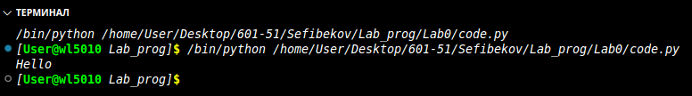

# Отчёт по Lab0

## Задание


$$ \frac{\pi}{2} = \prod_{i=1}^{\infty} \frac{4i^2}{4i^2 - 1}. $$

## Результаты вычислений

Очередной множитель произведения на Python:

```python
print('Hello')
```

При разнице последних значений произведения $\pi / 2$ менее `1e-7` вычисленное значение $\pi = 3.1411963131348553$.



Произведение Валлиса сходится очень медленно, поэтому рекомендуется использовать более эффективные методы вычисления числа $\pi$.


## Список использованных источников:

1. [Matplotlib cheatsheets and handouts](https://matplotlib.org/cheatsheets/)
2. [Markdown Cheat Sheet](https://www.markdownguide.org/cheat-sheet/)
3. [Writing mathematical expressions](https://docs.github.com/en/get-started/writing-on-github/working-with-advanced-formatting/writing-mathematical-expressions)