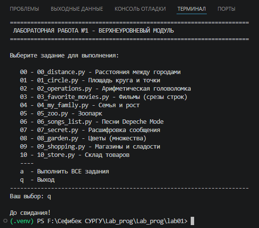

#Прог. Лабораторная работа №1
Основные типы и операции в Python

##Задания для самостоятельного выполнения

###**Сложность**:        *Rare*

1. Скачайте архив и распакуйте его в свой репозиторий. В нём 11 заданий, которые вам нужно выполнить.
2. Оформите отчёт в README.md. По каждому из заданий - описание задачи, скриншот работы программы.

Если вы чувствуете себя неуверенно, можно воспользоваться официальным туториалом.

###**Сложность**:        *Medium*

- Напишите верхнеуровневый модуль, который будет использовать логику из модулей-заданий. Перед этим нужно будет придумать способ инкапсулировать логику для корректного импортирования.

### Ход работы:

#### 1. Написание программ 

- отчёт выполнен в lab1

#### 2. Разработка верхнеуровневого модуля (Medium)

Для выполнения уровня сложности Medium был разработан верхнеуровневый модуль main.py, который:

1. Импортирует все модули заданий из папки tasks/ с помощью динамического импорта (так как имена файлов начинаются с цифр, что не позволяет использовать стандартный import).

2. Предоставляет интерактивное меню для выбора задания:

- Ввод номера задания (00-10) запускает соответствующее задание

- Ввод 'a' запускает все задания последовательно

- Ввод 'q' завершает работу программы

3. Инкапсулирует логику каждого задания в отдельный модуль, что обеспечивает:

- Модульность кода

- Возможность независимого запуска каждого задания

- Лёгкость добавления новых заданий

**Код верхнеуровневого модуля (основная часть):**

```python
def import_task(file_name):
    """Динамический импорт модуля из папки tasks"""
    tasks_dir = os.path.join(os.path.dirname(__file__), 'tasks')
    file_path = os.path.join(tasks_dir, file_name)
    spec = importlib.util.spec_from_file_location(module_name, file_path)
    module = importlib.util.module_from_spec(spec)
    spec.loader.exec_module(module)
    return module

def show_menu():
    """Интерактивное меню"""
    while True:
        # Вывод меню
        choice = input("Ваш выбор: ").strip().lower()
        
        if choice == 'a':
            run_all_tasks()
        elif choice in ['00', '01', ..., '10']:
            # Запуск выбранного задания
            tasks[choice].run()
        elif choice == 'q':
            break
```

#### 3. Скриншоты выполненой задачи

