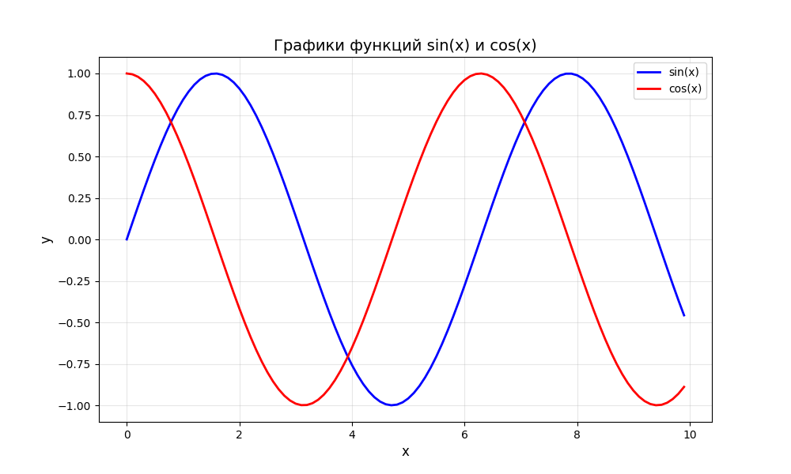
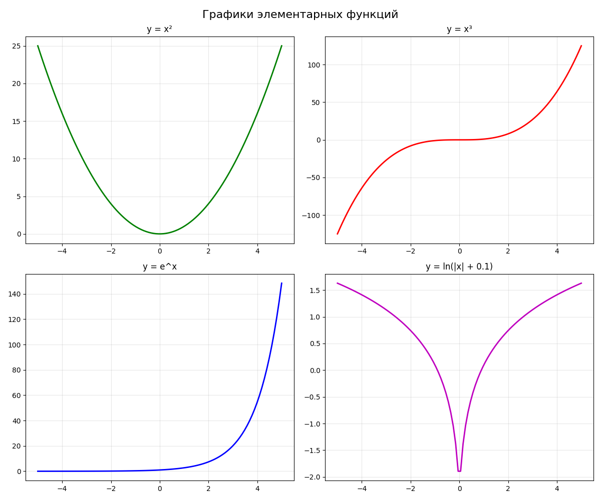
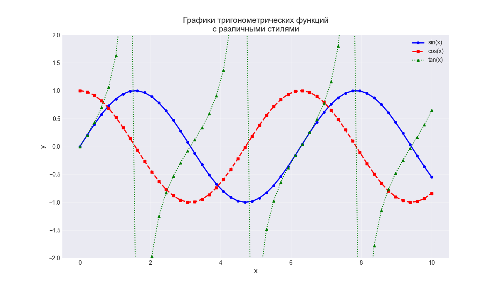
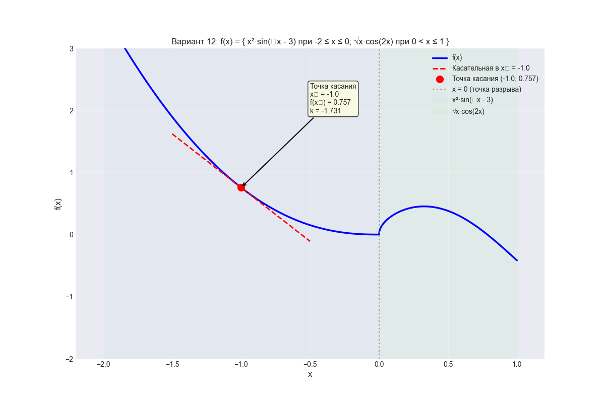
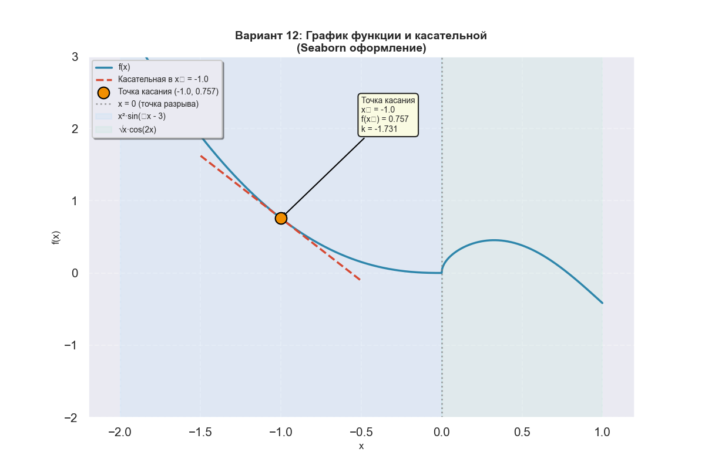

# Прог. Лабораторная работа №2

Построение графиков в Python

## Задания для самостоятельного выполнения

### **Сложность**:    *Rare*

1. Создайте в каталоге для данной ЛР в своём репозитории виртуальное окружение и установите в него matplotlib и numpy. Создайте файл requirements.txt.
2. Откройте книгу [1] и выполните уроки 1-3. Первый урок можно начинать со стр. 8.
3. Выберите одну из неразрывных функции своего варианта, постройте график этой функции и касательную к ней. Добавьте на график заголовок, подписи осей, легенду, сетку, а также аннотацию к точке касания.
4. Добавьте в корень своего репозитория файл .gitignore отсюда, перед тем как делать очередной коммит.
5. Оформите отчёт в README.md. Отчёт должен содержать:
- графики, построенные во время выполнения уроков из книги
- объяснения процесса решения и график по заданию 4
6. Склонируйте этот репозиторий НЕ в ваш репозиторий, а рядом. Изучите использование этого инструмента и создайте pdf-версию своего отчёта из README.md. Добавьте её в репозиторий.

### Варианты заданий
1. \( f(x) = \begin{cases} \cos(x+x^3), & 0 \le x \le 1; \\ e^{-x^2} - x^2 + 2x, & 1 \lt x \le  \end{cases} \)
2. \( f(x) = \begin{cases} e^{\sin x}, & 0 \le x \le \frac{1}{4}; \\ e^x - \frac{1}{\sqrt{x}}, & \frac{1}{4} \lt x \le \frac{1}{2}. \end{cases} \)
3. \( f(x) = \begin{cases} \cos(x)e^{-x^2}, & 0 \le x \le 1; \\ \ln(x+1) - \sqrt{4-x^2}, & 1 \lt x \le 2. \end{cases} \)
4. \( f(x) = \begin{cases} \sqrt{x+1} - \sqrt{x} - \frac{1}{2}, & 0 \le x \le 1; \\ e^{-x-\frac{1}{x}}, & 1 \lt x \le 2. \end{cases} \)
5. \( f(x) = \begin{cases} 2^x - 2 + x^2, & 0 \le x \le 1.5; \\ \sqrt{x}e^{-x^2}, & 1.5 \lt x \le 3. \end{cases} \)
6. \( f(x) = \begin{cases} 8x^3 \cos x, & 0 \le x \le 1; \\ \ln (1 + \sqrt{x}) - \cos x, & 1 \lt x \le 2. \end{cases} \)
7. \( f(x) = \begin{cases} e^{-2\sin x}, & -1 \le x \le 1; \\ x^2 - \ctg x, & 1 \lt x \le 2. \end{cases} \)
8. \( f(x) = \begin{cases} \frac{1}{1+25x^2}, & 0 \le x \le 0,6; \\ (x + 2x^4) \sin x^2, & 0.6 \lt x \le 1.6. \end{cases} \)
9. \( f(x) = \begin{cases} (x^2 - 2x^3) \cos x^2, & -1.5 \le x \le 0; \\ e^{\sin 2x}, & 0 \lt x \le 1.5. \end{cases} \)
10. \( f(x) = \begin{cases} -\cos e^x, & 0 \le x \le 1; \\ \ln (2x + \sin x^2), & 1 \lt x \le 2. \end{cases} \)
11. \( f(x) = \begin{cases} x^2 \arctg x, & 0 \le x \le 1; \\ \sin \frac{1}{x^2}, & 1 \lt x \le 2. \end{cases} \)
12. \( f(x) = \begin{cases} x^2 \sin (\sqrt[3]{x} - 3), & -2 \le x \le 0; \\ \sqrt{x} \cos 2x, & 0 \lt x \le 1. \end{cases} \)

### **Сложность**:      *Medium*

- Постройте все графики с использованием seaborn вместо matplotlib

### Ход работы:

#### 1. Написание программ 

- отчёт выполнен в lab2

#### 2. Уровень Medium: реализация с использованием Seaborn

Для достижения уровня сложности Medium был создан график с использованием библиотеки seaborn, которая предоставляет:

1. **Улучшенные стили "из коробки"** - использован стиль darkgrid

2. **Современную цветовую палитру** - палитра viridis

3. **Более качественное оформление** - легенда с тенью, рамкой и скруглёнными углами

4. **Оптимальные настройки шрифтов** - контекст talk для лучшей читаемости

**Код настройки Seaborn:**

~~~python
import seaborn as sns

sns.set_theme(style='darkgrid', palette='viridis')
sns.set_context('talk', font_scale=0.9)
~~~

#### 3. Скриншоты выполненой задачи

```bash
task1_plot.py
```


```bash
task2_plot.py
```


```bash
task3_plot.py
```


```bash
python variant_matplotlib.py
```


```bash
python variant_seaborn.py
```
