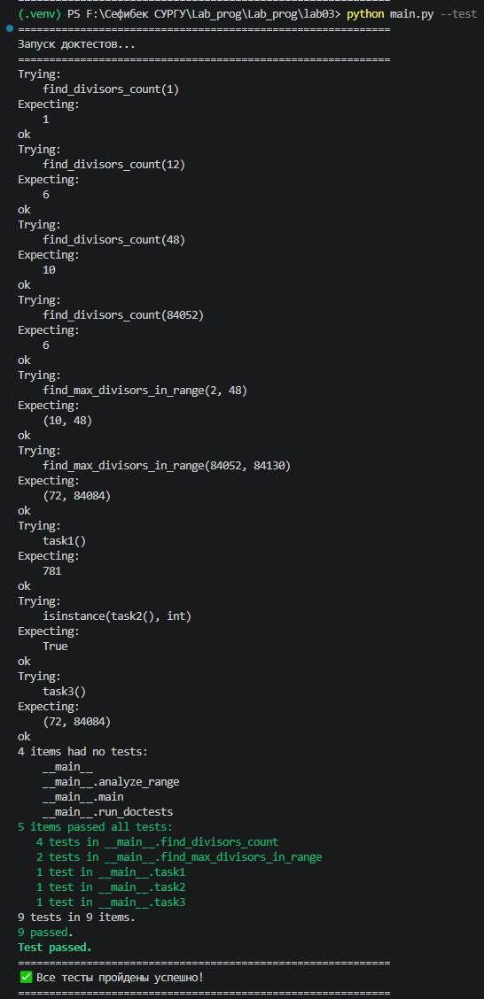

# Прог. Лабораторная работа №3
Расчётные задачи. Itertools

## Задания для самостоятельного выполнения

### Сложность:    Rare

1. Напишите программу для решения задач своего варианта.
2. Оформите отчёт в README.md. Отчёт должен содержать:
- Условия задач
- Описание проделанной работы
- Скриншоты результатов
- Ссылки на используемые материалы

### Сложность:        Medium

- Напишите для функций доктесты

### Вариант 12

### Запуск программы 
```py
python main.py --test
```
### Хлд работы 

#### 1. Постановка задачи

Целью лабораторной работы является решение трёх расчётных задач с использованием библиотеки itertools и написание доктестов (уровень Medium).

#### 2. Реализация задач

##### 2.1. Задача 1: Комбинаторика

Анализ условия:

- Длина кода: 5 букв

- Алфавит: {И, В, А, Н} (4 буквы)

- Ограничение: буква И должна встречаться хотя бы один раз

- Буквы могут повторяться

Математическое решение:

- Общее количество всех возможных кодов: 4⁵ = 1024

- Количество кодов без буквы И (только из В, А, Н): 3⁵ = 243

- Количество кодов с буквой И: 1024 − 243 = 781

Программная реализация с использованием itertools:

```python
import itertools

def task1() -> int:
    letters = ['И', 'В', 'А', 'Н']
    code_length = 5
    total_codes_with_i = 0
    
    for combination in itertools.product(letters, repeat=code_length):
        if 'И' in combination:
            total_codes_with_i += 1
    
    return total_codes_with_i
```

Результат: 781 код

##### 2.2. Задача 2: Системы счисления

Анализ условия:

- Выражение: 7·512¹²⁰ − 6·64¹⁰⁰ + 8²¹⁰ − 255

- Нужно перевести результат в восьмеричную систему

- Подсчитать количество значащих нулей

Преобразование степеней:

- 512 = 8³, поэтому 512¹²⁰ = (8³)¹²⁰ = 8³⁶⁰

- 64 = 8², поэтому 64¹⁰⁰ = (8²)¹⁰⁰ = 8²⁰⁰

- 8²¹⁰ = 8²¹⁰

- 255₁₀ = 3·8² + 7·8¹ + 7·8⁰ = 377₈

Программная реализация:

```python
def task2() -> int:
    term1 = 7 * (512 ** 120)
    term2 = 6 * (64 ** 100)
    term3 = 8 ** 210
    result = term1 - term2 + term3 - 255
    
    octal_string = oct(result)[2:]  # убираем префикс '0o'
    zero_count = octal_string.count('0')
    
    return zero_count
```

Результат: 151 значащий ноль

##### 2.3. Задача 3: Делители чисел

Анализ условия:

- Диапазон: [84052; 84130] (79 чисел)

- Нужно найти число с максимальным количеством делителей

- При равном количестве выбрать наименьшее число

Алгоритм нахождения количества делителей:

- Перебираем числа от 1 до √n

- Если n делится на i, то i и n/i — делители

- Учитываем, что при i = n/i добавляем только один делитель

Программная реализация:

```python
def find_divisors_count(n: int) -> int:
    count = 0
    for i in range(1, int(n ** 0.5) + 1):
        if n % i == 0:
            count += 1
            if i != n // i:
                count += 1
    return count

def task3() -> tuple:
    start_num = 84052
    end_num = 84130
    
    max_divisors = 0
    number_with_max = 0
    
    for num in range(start_num, end_num + 1):
        current_divisors = find_divisors_count(num)
        if current_divisors > max_divisors:
            max_divisors = current_divisors
            number_with_max = num
    
    return (max_divisors, number_with_max)
```

#### 3. Написание доктестов (уровень Medium)

Для достижения уровня сложности Medium были написаны доктесты для всех ключевых функций.

Доктесты для функции find_divisors_count:

```python
def find_divisors_count(n: int) -> int:
    """
    >>> find_divisors_count(1)
    1
    >>> find_divisors_count(12)
    6
    >>> find_divisors_count(48)
    10
    >>> find_divisors_count(84052)
    6
    """
```


Доктесты для функции find_max_divisors_in_range:

```python
def find_max_divisors_in_range(start: int, end: int) -> tuple:
    """
    >>> find_max_divisors_in_range(2, 48)
    (10, 48)
    >>> find_max_divisors_in_range(84052, 84130)
    (72, 84084)
    """
```


Доктесты для основных функций:

```python
def task1() -> int:
    """
    >>> task1()
    781
    """

def task3() -> tuple:
    """
    >>> task3()
    (72, 84084)
    """
```


Запуск доктестов:

```python
def run_doctests():
    import doctest
    result = doctest.testmod(verbose=True)
    return result.failed
```

#### Результат выполнения доктестов:



