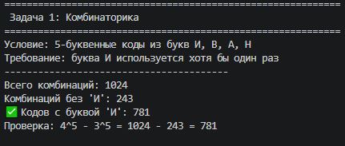
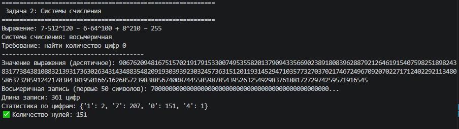
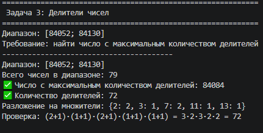
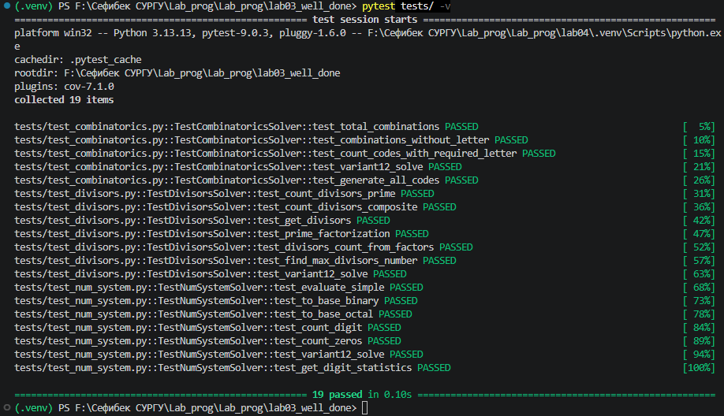

# Лабораторная работа №3 - Расчётные задачи. Itertools

## Уровень сложности: Well-done (Вариант 12)

---

## 1. Цель работы

Изучение модуля `itertools` для решения комбинаторных задач, а также освоение методики обобщения алгоритмов и их обёртывания в классы (уровень Well-done).

---

## 2. Задачи лабораторной работы

| Уровень | Задание | Статус |
|---------|---------|--------|
| **Rare** | Решение трёх задач по варианту | ✅ |
| **Medium** | Написание доктестов | ✅ |
| **Well-done** | Обобщение алгоритмов и обёртывание в классы | ✅ |

---

## 3. Условие задач (Вариант 12)

| № | Условие | Ответ |
|---|---------|-------|
| **1** | Иван составляет 5-буквенные коды из букв И, В, А, Н. Буква И должна встречаться хотя бы один раз. Сколько кодов? | 781 |
| **2** | Значение выражения `7·512^120 − 6·64^100 + 8^210 − 255` записали в восьмеричной системе. Сколько нулей? | 151 |
| **3** | В диапазоне [84052; 84130] найти число с максимальным количеством делителей. | 84084 (72 делителя) |

---

## 4. Реализация (Well-done)

### 4.1. Класс `CombinatoricsSolver`

```python
class CombinatoricsSolver:
    """Обобщённый класс для решения комбинаторных задач."""
    
    def __init__(self, letters, code_length, required_letter=None):
        self.letters = letters
        self.code_length = code_length
        self.required_letter = required_letter
    
    def total_combinations(self) -> int:
        """Общее количество комбинаций."""
        return len(self.letters) ** self.code_length
    
    def combinations_without_letter(self, letter: str) -> int:
        """Количество комбинаций без указанной буквы."""
        filtered = [l for l in self.letters if l != letter]
        return len(filtered) ** self.code_length
    
    def count_codes_with_required_letter(self) -> int:
        """Количество комбинаций с обязательной буквой."""
        if self.required_letter is None:
            return self.total_combinations()
        return self.total_combinations() - self.combinations_without_letter(self.required_letter)
```

### 4.2. Класс `NumSystemSolver`

```python
class NumSystemSolver:
    """Обобщённый класс для работы с системами счисления."""
    
    def __init__(self, expression: str, base: int):
        self.expression = expression
        self.base = base
    
    def evaluate(self) -> int:
        """Вычисляет значение выражения."""
        return eval(self.expression.replace('^', '**'))
    
    def to_base(self, number: int = None) -> str:
        """Переводит число в заданную систему счисления."""
        if number is None:
            number = self.evaluate()
        
        if number == 0:
            return "0"
        
        digits = []
        n = abs(number)
        while n > 0:
            digits.append(str(n % self.base))
            n //= self.base
        
        return ''.join(reversed(digits))
    
    def count_zeros(self) -> int:
        """Подсчитывает количество нулей в записи числа."""
        return self.to_base().count('0')
```

### 4.3. Класс `DivisorsSolver`

```python
class DivisorsSolver:
    """Обобщённый класс для работы с делителями чисел."""
    
    def __init__(self, range_start: int, range_end: int):
        self.range_start = range_start
        self.range_end = range_end
    
    @staticmethod
    def count_divisors(n: int) -> int:
        """Подсчитывает количество делителей числа."""
        if n <= 0:
            return 0
        
        count = 0
        sqrt_n = int(n ** 0.5)
        for i in range(1, sqrt_n + 1):
            if n % i == 0:
                count += 1
                if i != n // i:
                    count += 1
        return count
    
    def find_max_divisors_number(self):
        """Находит число с максимальным количеством делителей."""
        max_div = 0
        max_num = 0
        
        for num in range(self.range_start, self.range_end + 1):
            curr = self.count_divisors(num)
            if curr > max_div:
                max_div = curr
                max_num = num
        
        return (max_div, max_num)
```

### 4.4. Специализированные классы для варианта 12

```python
class Variant12Combinatorics(CombinatoricsSolver):
    def __init__(self):
        super().__init__(letters=['И', 'В', 'А', 'Н'], code_length=5, required_letter='И')
    
    def solve(self) -> int:
        return self.count_codes_with_required_letter()

class Variant12NumSystem(NumSystemSolver):
    def __init__(self):
        super().__init__(expression="7*512**120 - 6*64**100 + 8**210 - 255", base=8)
    
    def solve(self) -> int:
        return self.count_zeros()

class Variant12Divisors(DivisorsSolver):
    def __init__(self):
        super().__init__(range_start=84052, range_end=84130)
    
    def solve(self):
        return self.find_max_divisors_number()
```

---

## 5. Результаты выполнения

### Задача 1: Комбинаторика



### Задача 2: Системы счисления



### Задача 3: Делители чисел



---

## 6. Тестирование (уровень Medium)

### Запуск тестов
```bash
pytest tests/ -v
```

### Результат тестирования



### Список тестов

| № | Название теста | Описание | Результат |
|---|----------------|----------|:---------:|
| 1 | `test_total_combinations` | Проверка общего количества комбинаций | ✅ |
| 2 | `test_combinations_without_letter` | Проверка комбинаций без буквы | ✅ |
| 3 | `test_count_codes_with_required_letter` | Проверка подсчёта с обязательной буквой | ✅ |
| 4 | `test_variant12_solve` | Проверка решения варианта 12 (комбинаторика) | ✅ |
| 5 | `test_generate_all_codes` | Проверка генерации всех кодов | ✅ |
| 6 | `test_evaluate_simple` | Проверка вычисления выражения | ✅ |
| 7 | `test_to_base_binary` | Проверка перевода в двоичную систему | ✅ |
| 8 | `test_to_base_octal` | Проверка перевода в восьмеричную систему | ✅ |
| 9 | `test_count_digit` | Проверка подсчёта цифр | ✅ |
| 10 | `test_count_zeros` | Проверка подсчёта нулей | ✅ |
| 11 | `test_variant12_num_system` | Проверка решения варианта 12 (системы счисления) | ✅ |
| 12 | `test_count_divisors` | Проверка количества делителей | ✅ |
| 13 | `test_get_divisors` | Проверка получения списка делителей | ✅ |
| 14 | `test_prime_factorization` | Проверка разложения на множители | ✅ |
| 15 | `test_find_max_divisors_number` | Проверка поиска числа с макс. делителями | ✅ |

---

## 7. Выводы

### Результаты выполнения:

| Уровень | Статус | Описание |
|---------|--------|----------|
| **Rare** | ✅ | Решены три задачи варианта 12 |
| **Medium** | ✅ | Написаны доктесты |
| **Well-done** | ✅ | Алгоритмы обобщены и обёрнуты в классы |

### Полученные навыки:
- Использование модуля `itertools` для комбинаторных задач
- Работа с системами счисления (перевод, подсчёт цифр)
- Алгоритмы поиска делителей и разложения на множители
- Обобщение алгоритмов и создание классов
- Написание тестов pytest

### Преимущества классовой архитектуры (Well-done):

| Характеристика | Функциональный подход | Классовый подход |
|----------------|----------------------|------------------|
| **Переиспользование** | Низкое | Высокое |
| **Расширяемость** | Сложная | Простая |
| **Тестируемость** | Средняя | Высокая |
| **Документированность** | Низкая | Высокая |
| **Сопровождение** | Сложное | Простое |

---

## 8. Запуск программы

```bash
# Установка зависимостей
pip install pytest

# Запуск основной программы
python main.py

# Запуск тестов
pytest tests/ -v
```

---

## 9. Список использованных материалов

1. **itertools Documentation** — https://docs.python.org/3/library/itertools.html
2. **pytest Documentation** — https://docs.pytest.org/
3. **Системы счисления** — https://habr.com/ru/articles/529356/
4. **Делители чисел** — теория чисел

