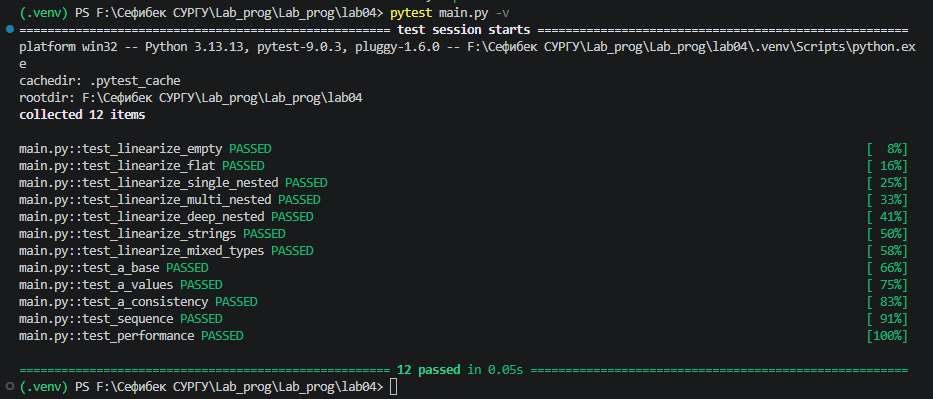

# Прог. Лабораторная работа №4

Рекурсия

## Задания для самостоятельного выполнения

### **Сложность**:    *Rare*

1. Напишите две функции для решения задач своего варианта - с использованием рекурсии и без.

2. Оформите отчёт в README.md. Отчёт должен содержать:
- Условия задач
- Описание проделанной работы
- Скриншоты результатов
- Ссылки на используемые материалы

### **Сложность**:      *Medium*

- Напишите для своих функций тесты с помощью pytest

### Варианты заданий

12. 
- Функция для вычисления всех перестановок списка длиной *k*.
```py
>>> k_permutaions([1, 2, 3], 2)
[[1, 2], [1, 3], [2, 1], [2, 3], [3, 1], [3, 2]]
```
- Функция для вычисления $$ x_i = i \cdot x_{i-1} + \frac{1}{i}, \quad x_0 = 0 $$

### Ход работы:

#### 1. Написание программ 

- отчёт выполнен в lab4

#### 2. Уровень Medium:

##### 2.1. Реализация линеаризации списков

**Рекурсивная версия**

Рекурсивный подход заключается в обходе каждого элемента списка. Если элемент является списком, функция вызывает себя рекурсивно для обработки вложенных элементов.

```python
def linearize_recursive(nested_list):
    result = []
    for item in nested_list:
        if isinstance(item, list):
            result.extend(linearize_recursive(item))
        else:
            result.append(item)
    return result
```
**Принцип работы:**

1. Создаётся пустой список result

2. Для каждого элемента входного списка:

- Если элемент — список → рекурсивный вызов

- Если элемент — не список → добавляется в результат

3. Возвращается плоский список

**Итеративная версия**

Итеративный подход использует стек для обхода элементов без рекурсии.

```python
def linearize_iterative(nested_list):
    if not nested_list:
        return []
    result = []
    stack = [nested_list]
    while stack:
        current = stack.pop(0)
        if isinstance(current, list):
            stack = current + stack
        else:
            result.append(current)
    return result
```
**Принцип работы:**

1. В стек помещается исходный список

2. Пока стек не пуст:

- Извлекается первый элемент

- Если элемент — список → его элементы добавляются в начало стека

- Если элемент — не список → добавляется в результат

3. Возвращается плоский список

##### 2.2. Реализация рекуррентной последовательности

**Рекурсивная версия**

```python
def a_recursive(k):
    def helper(n):
        if n == 1:
            return 1, 1
        a_prev, b_prev = helper(n - 1)
        a_n = 2 * b_prev + a_prev
        b_n = 2 * a_prev + b_prev
        return a_n, b_n
    return helper(k)[0]
```
**Принцип работы:**

- Вспомогательная функция helper возвращает пару (aₙ, bₙ)

- Базовый случай: n = 1 → (1, 1)

- Рекурсивный случай: вычисление через предыдущие значения

**Итеративная версия**
```python
def a_iterative(k):
    if k == 1:
        return 1
    a_prev, b_prev = 1, 1
    for _ in range(2, k + 1):
        a_curr = 2 * b_prev + a_prev
        b_curr = 2 * a_prev + b_prev
        a_prev, b_prev = a_curr, b_curr
    return a_prev
```
**Принцип работы:**

- Базовый случай: k = 1 → возвращается 1

- Для k > 1: последовательное вычисление от a₂ до aₖ

#### 3. Тестирование (уровень Medium)

Для проверки корректности функций написаны 12 тестов с использованием библиотеки pytest.

##### 3.1 Запуск тестов
```bash
pytest main.py -v
```

##### 3.2. Результат тестирования



##### 3.3. Список тестов

| № | Название теста | Описание |
|---|----------------|----------|
| 1 | `test_linearize_empty` | Проверка пустого списка |
| 2 | `test_linearize_flat` | Проверка плоского списка |
| 3 | `test_linearize_single_nested` | Проверка одноуровневой вложенности |
| 4 | `test_linearize_multi_nested` | Проверка многоуровневой вложенности |
| 5 | `test_linearize_deep_nested` | Проверка глубокой вложенности |
| 6 | `test_linearize_strings` | Проверка строковых элементов |
| 7 | `test_linearize_mixed_types` | Проверка смешанных типов |
| 8 | `test_a_base` | Проверка базовых случаев |
| 9 | `test_a_values` | Проверка значений последовательности |
| 10 | `test_a_consistency` | Проверка согласованности версий |
| 11 | `test_sequence` | Проверка получения последовательности |
| 12 | `test_performance` | Проверка производительности |