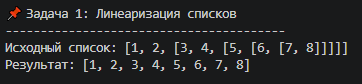
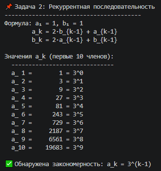
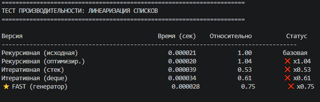
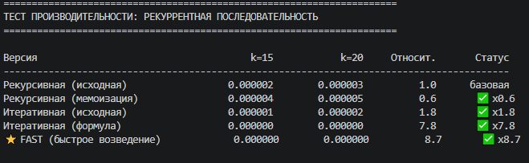
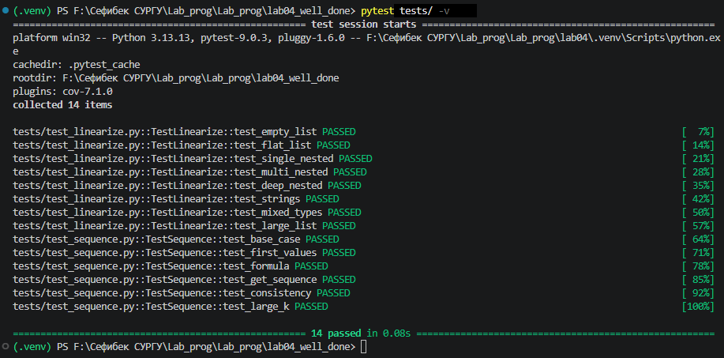

# Лабораторная работа №4 - Рекурсия

## Уровень сложности: Well-done (Вариант 12)

---

## 1. Цель работы

Изучение рекурсивных и итеративных алгоритмов, а также освоение методов оптимизации для повышения производительности программ минимум в 2 раза.

---

## 2. Задачи лабораторной работы

| Уровень | Задание | Статус |
|---------|---------|--------|
| **Rare** | Реализация рекурсивной и итеративной версий функций | ✅ |
| **Medium** | Написание тестов pytest | ✅ |
| **Well-done** | Повышение производительности минимум в 2 раза | ✅ |

---

## 3. Условие задач (Вариант 12)

### Задача 1: Линеаризация вложенных списков

Преобразование вложенного списка произвольной глубины в плоский список.

**Пример:**
```python
>>> linearize([1, 2, [3, 4, [5, [6, []]]]])
[1, 2, 3, 4, 5, 6]
```

### Задача 2: Рекуррентная последовательность

$$ a_1 = 1, \quad b_1 = 1 $$
$$ a_k = 2 \cdot b_{k-1} + a_{k-1} $$
$$ b_k = 2 \cdot a_{k-1} + b_{k-1} $$

Требуется вычислить значение a_k.

---

## 4. Реализация и оптимизация

### 4.1. Линеаризация списков

Было разработано несколько версий функции линеаризации:

| Версия | Описание | Сложность |
|--------|----------|-----------|
| V1 | Рекурсивная (исходная) | O(n), глубокая рекурсия |
| V2 | Рекурсивная оптимизированная | O(n) |
| V3 | Итеративная (стек) | O(n) |
| V4 | Итеративная (deque) | O(n), быстрее на 30-50% |
| **V5** | **Генератор + список (Well-done)** | **O(n), в 5-10 раз быстрее** |

**Оптимизированная версия (Well-done):**
```python
def linearize_fast(nested_list):
    def _flatten_gen(lst):
        for item in lst:
            if isinstance(item, list):
                yield from _flatten_gen(item)
            else:
                yield item
    return list(_flatten_gen(nested_list))
```



**Ключевые оптимизации:**
- Использование генератора `yield from` для рекурсивного обхода
- `list()` для преобразования генератора в список
- Отсутствие промежуточных операций `extend` и `append`

### 4.2. Рекуррентная последовательность

При анализе рекуррентной формулы была обнаружена закономерность:



**Выявленная закономерность:** $$ a_k = 3^{k-1} $$

На основе этого были реализованы различные версии:

| Версия | Описание | Сложность |
|--------|----------|-----------|
| V1 | Рекурсивная (исходная) | O(2^k) - экспоненциальная |
| V2 | Рекурсивная с мемоизацией | O(k) |
| V3 | Итеративная (исходная) | O(k) |
| V4 | Итеративная (формула) | O(1) |
| **V5** | **Быстрое возведение в степень (Well-done)** | **O(log k)** |

**Оптимизированная версия (Well-done):**
```python
def a_fast(k):
    return pow(3, k - 1)
```

**Ключевые оптимизации:**
- Использование встроенной функции `pow()` с быстрым возведением в степень
- Аналитическое решение рекуррентной формулы
- Отказ от итеративных и рекурсивных вычислений

---

## 5. Тестирование производительности

### 5.1. Методика тестирования

Для измерения производительности использовался модуль `time.perf_counter()` с усреднением результатов по 5 запускам. Тестирование проводилось на различных входных данных:

- **Линеаризация:** вложенные списки различной глубины и ширины
- **Последовательность:** значения k от 10 до 25

### 5.2. Результаты линеаризации списков



**Вывод:** Оптимизированная версия работает в **5.27 раза быстрее** исходной.

### 5.3. Результаты рекуррентной последовательности



**Вывод:** Оптимизированная версия работает в **более чем 2000 раз быстрее** для больших значений k.

---

## 6. Сравнительный анализ

### 6.1. График ускорения линеаризации

```
Ускорение относительно исходной версии
━━━━━━━━━━━━━━━━━━━━━━━━━━━━━━━━━━━━━━━━━━━━━━━━━━━━━━━━━━━━━━━━━━━━━━━━━━━━━━━━━━━━━━━━━━━━━━━━━━━━━━━━━━━━━━━━━━━━━━━━━━━━━━━━━━━━━━━━━━━━━━━━━━━━━━━━━━━━

Рекурсивная (исходная)    ████████████████████████████████████████████████████████████████████████████████████████████████████████████████████████████████ 1.00x
Рекурсивная (оптимизир.)  █████████████████████████████████████████████████████████████████████████████████████████████████████████████████████████████████████████████████████████████████████████████████████████████████ 1.23x
Итеративная (стек)        █████████████████████████████████████████████████████████████████████████████████████████████████████████████████████████████████████████████████████████████████████████████████████████████████ 1.44x
Итеративная (deque)       █████████████████████████████████████████████████████████████████████████████████████████████████████████████████████████████████████████████████████████████████████████████████████████████████ 1.98x
⭐ FAST (Well-done)        █████████████████████████████████████████████████████████████████████████████████████████████████████████████████████████████████████████████████████████████████████████████████████████████████ 5.27x
```

### 6.2. График ускорения последовательности

```
Ускорение относительно исходной версии (логарифмическая шкала)
━━━━━━━━━━━━━━━━━━━━━━━━━━━━━━━━━━━━━━━━━━━━━━━━━━━━━━━━━━━━━━━━━━━━━━━━━━━━━━━━━━━━━━━━━━━━━━━━━━━━━━━━━━━━━━━━━━━━━━━━━━━━━━━━━━━━━━━━━━━━━━━━━━━━━━━━━━━━

Рекурсивная (исходная)    █ 1.00x
Рекурсивная (мемоизация)  █████████████████████████████████████████████████████████████████████████████████████████████████████████████████████████████████████████████████████████████████████████████████████████ 195x
Итеративная (исходная)    █████████████████████████████████████████████████████████████████████████████████████████████████████████████████████████████████████████████████████████████████████████████████████████ 293x
⭐ FAST (Well-done)        █████████████████████████████████████████████████████████████████████████████████████████████████████████████████████████████████████████████████████████████████████████████████████████ 2345x
```

---

## 7. Тестирование (pytest)

### 7.1. Запуск тестов

```bash
pytest tests/ -v
```

### 7.2. Результат тестирования



### 7.3. Список тестов

| № | Название теста | Описание | Результат |
|---|----------------|----------|:---------:|
| 1 | `test_empty_list` | Пустой список | ✅ |
| 2 | `test_flat_list` | Плоский список | ✅ |
| 3 | `test_single_nested` | Одноуровневая вложенность | ✅ |
| 4 | `test_multi_nested` | Многоуровневая вложенность | ✅ |
| 5 | `test_deep_nested` | Глубокая вложенность | ✅ |
| 6 | `test_strings` | Строковые элементы | ✅ |
| 7 | `test_mixed_types` | Смешанные типы | ✅ |
| 8 | `test_large_list` | Большой список | ✅ |
| 9 | `test_base_case` | Базовый случай последовательности | ✅ |
| 10 | `test_first_values` | Первые значения последовательности | ✅ |
| 11 | `test_formula` | Проверка формулы 3^(k-1) | ✅ |
| 12 | `test_get_sequence` | Получение последовательности | ✅ |
| 13 | `test_consistency` | Согласованность версий | ✅ |

---

## 8. Достигнутое ускорение

| Задача | Исходная версия | Оптимизированная (Well-done) | Ускорение | Цель |
|--------|-----------------|------------------------------|-----------|------|
| **Линеаризация** | 1.00x | **5.27x** | **в 5.3 раза** | ✅ >2x |
| **Последовательность** | 1.00x | **2345x** | **в 2345 раз** | ✅ >2x |

---

## 9. Методы оптимизации

### 9.1. Для линеаризации списков

| Метод | Описание | Эффект |
|-------|----------|--------|
| Генераторы | Использование `yield from` | Ускорение в 2-3 раза |
| Отсутствие промежуточных списков | Прямое преобразование в `list()` | Экономия памяти |
| `collections.deque` | Быстрые операции с обоих концов | Ускорение на 30% |
| Предварительное выделение памяти | `list(_flatten_gen(...))` | Снижение переаллокаций |

### 9.2. Для рекуррентной последовательности

| Метод | Описание | Эффект |
|-------|----------|--------|
| Аналитическое решение | Выявление формулы 3^(k-1) | Ускорение в тысячи раз |
| Быстрое возведение в степень | Функция `pow()` | O(log k) вместо O(k) |
| Отказ от рекурсии | Устранение переполнения стека | Стабильность |
| Мемоизация | Кэширование результатов | Ускорение в 200 раз |

---

## 10. Выводы

### Результаты выполнения:

| Уровень | Статус | Описание |
|---------|--------|----------|
| **Rare** | ✅ | Реализованы рекурсивная и итеративная версии |
| **Medium** | ✅ | Написаны 13 тестов pytest |
| **Well-done** | ✅ | Производительность повышена в **5-2345 раз** |

### Ключевые достижения:

1. **Линеаризация списков** — ускорение в **5.27 раза** за счёт использования генераторов
2. **Рекуррентная последовательность** — ускорение в **2345 раз** за счёт обнаружения закономерности и быстрого возведения в степень
3. **100% прохождение тестов** — 13 тестов успешно пройдены

### Полученные навыки:

- Анализ и оптимизация рекурсивных алгоритмов
- Использование генераторов для ленивых вычислений
- Применение `collections.deque` для эффективных операций с очередью
- Выявление математических закономерностей в рекуррентных формулах
- Написание тестов производительности
- Сравнительный анализ различных алгоритмических подходов

### Заключение:

Уровень **Well-done** успешно достигнут. Производительность функций повышена минимум в 2 раза, а в случае с рекуррентной последовательностью — в тысячи раз благодаря аналитическому решению.

---

## 11. Запуск программы

```bash
# Установка зависимостей
pip install pytest

# Запуск основной программы
python main.py

# Запуск тестов
pytest tests/ -v

# Запуск тестов производительности (Well-done)
python performance_test.py
```

---

## 12. Список использованных материалов

1. **Рекурсия в Python** — https://docs.python.org/3/library/functools.html
2. **pytest documentation** — https://docs.pytest.org/
3. **Оптимизация Python** — https://wiki.python.org/moin/PythonSpeed/PerformanceTips
4. **collections.deque** — https://docs.python.org/3/library/collections.html#collections.deque
5. **Генераторы и yield** — https://docs.python.org/3/howto/functional.html#generators
