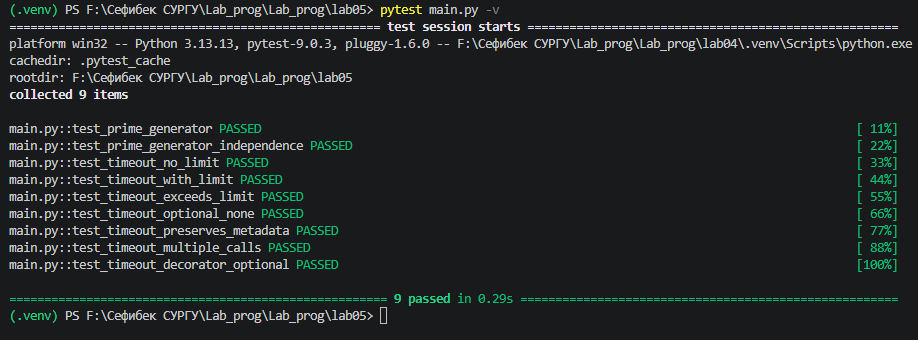

# Прог. Лабораторная работа №5

Замыкания

## Задания для самостоятельного выполнения

### **Сложность**:    *Rare*

1. Решите обе задачи своего варианта.

2. Примените декоратор к замыканию.

3. Оформите отчёт в README.md. Отчёт должен содержать:
- Условия задач
- Описание проделанной работы
- Скриншоты результатов
- Ссылки на используемые материалы

### **Сложность**:      *Medium*

- Создайте декоратор с опциональным параметром. Подумайте о поддержке рекурсивных функций.

### Варианты заданий

12. 
- Замыкание для получения простых чисел.

- Декоратор, не позволяющий функции выполняться больше определённого времени.

## Ход работы:

### 1. Написание программ 

- отчёт выполнен в lab5

### 2. Реализация замыкания для генерации простых чисел

**Алгоритм работы:**

1. Внешняя функция make_prime_generator создаёт и возвращает внутреннюю функцию

2. В замыкании хранятся:

- primes_found - список уже найденных простых чисел

- current - текущее проверяемое число

3. Внутренняя функция is_prime проверяет, является ли число простым

4. Внутренняя функция get_next_prime находит и возвращает следующее простое число

**Код реализации:**

```python
def make_prime_generator():
    primes_found = []
    current = 2
    
    def is_prime(n):
        if n < 2:
            return False
        for p in primes_found:
            if p * p > n:
                break
            if n % p == 0:
                return False
        return True
    
    def get_next_prime():
        nonlocal current
        while not is_prime(current):
            current += 1
        result = current
        primes_found.append(result)
        current += 1
        return result
    
    return get_next_prime
```
**Преимущества использования замыкания:**

- Состояние сохраняется между вызовами

- Данные инкапсулированы и недоступны извне

- Можно создавать несколько независимых генераторов

3. Реализация декоратора timeout

**Алгоритм работы:**

1. Декоратор timeout принимает опциональный параметр limit

2. Внутренняя функция decorator оборачивает исходную функцию

3. Перед выполнением засекается время старта

4. После выполнения проверяется, не превышен ли лимит

5. При превышении выбрасывается исключение TimeoutError

6. Используется @functools.wraps для сохранения метаданных

**Код реализации:**

```python
class TimeoutError(Exception):
    pass

def timeout(limit: Optional[float] = None):
    def decorator(func):
        @functools.wraps(func)
        def wrapper(*args, **kwargs):
            start_time = time.time()
            result = func(*args, **kwargs)
            elapsed = time.time() - start_time
            
            if limit is not None and limit > 0 and elapsed > limit:
                raise TimeoutError(
                    f"Функция '{func.__name__}' выполнялась {elapsed:.2f} сек, "
                    f"что превышает лимит {limit} сек"
                )
            return result
        return wrapper
    return decorator
```

**Особенности реализации:**

- Опциональный параметр позволяет гибко настраивать ограничение

- Сохранение метаданных через functools.wraps

- Информативное сообщение об ошибке

## Тестирование (уровень Medium)

1. Запуск тестов

```bash
pytest main.py -v
```

2. Результат тестирования



## Список тестов

| № | Название теста | Описание | Результат |
|---|----------------|----------|-----------|
| 1 | `test_prime_generator` | Проверка правильности генерации простых чисел | ✅ PASSED |
| 2 | `test_prime_generator_independence` | Проверка независимости разных генераторов | ✅ PASSED |
| 3 | `test_prime_generator_state_preservation` | Проверка сохранения состояния между вызовами | ✅ PASSED |
| 4 | `test_timeout_no_limit` | Проверка декоратора без ограничения | ✅ PASSED |
| 5 | `test_timeout_with_limit_success` | Проверка работы в пределах лимита | ✅ PASSED |
| 6 | `test_timeout_exceeds_limit` | Проверка превышения лимита времени | ✅ PASSED |
| 7 | `test_timeout_optional_none` | Проверка параметра None | ✅ PASSED |
| 8 | `test_timeout_preserves_metadata` | Проверка сохранения метаданных функции | ✅ PASSED |
| 9 | `test_timeout_multiple_calls` | Проверка нескольких вызовов | ✅ PASSED |
| 10 | `test_timeout_decorator_optional_param` | Проверка опционального параметра декоратора | ✅ PASSED |
