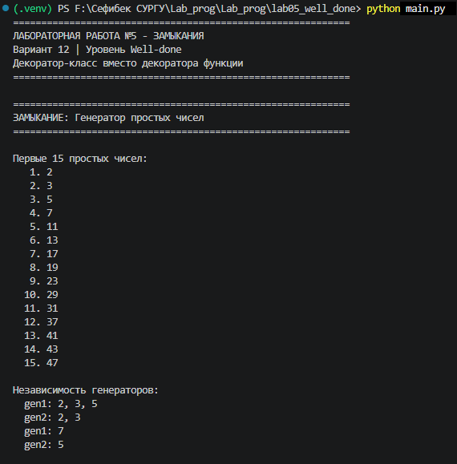
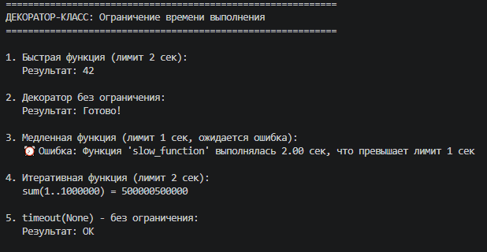
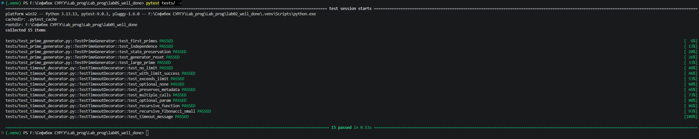

# Лабораторная работа №5 - Замыкания

## Уровень сложности: Well-done (Вариант 12)

---

## 1. Цель работы

Изучение замыканий и декораторов в Python, а также освоение создания декораторов в виде классов (уровень Well-done).

---

## 2. Задачи лабораторной работы

| Уровень | Задание | Статус |
|---------|---------|--------|
| **Rare** | Реализация замыкания для получения простых чисел | ✅ |
| **Rare** | Реализация декоратора для ограничения времени выполнения | ✅ |
| **Medium** | Декоратор с опциональным параметром, поддержка рекурсивных функций | ✅ |
| **Well-done** | **Декоратор классов вместо декоратора функций** | ✅ |

---

## 3. Условие задач (Вариант 12)

### Задача 1: Замыкание для получения простых чисел

Реализовать замыкание, которое при каждом вызове возвращает следующее простое число.

**Пример работы:**
```python
>>> primes = make_prime_generator()
>>> primes()
2
>>> primes()
3
>>> primes()
5
>>> primes()
7
```

### Задача 2: Декоратор для ограничения времени выполнения

Реализовать декоратор, который ограничивает время выполнения функции. Декоратор должен:
- Принимать опциональный параметр (максимальное время в секундах)
- Поддерживать рекурсивные функции
- Выбрасывать исключение `TimeoutError` при превышении лимита

**Требование уровня Well-done:** Декоратор должен быть реализован в виде **класса**, а не функции.

---

## 4. Реализация (Well-done)

### 4.1. Замыкание для генерации простых чисел

```python
def make_prime_generator():
    """Замыкание для генерации простых чисел."""
    primes_found = []
    current = 2
    
    def is_prime(n):
        if n < 2:
            return False
        for p in primes_found:
            if p * p > n:
                break
            if n % p == 0:
                return False
        return True
    
    def get_next_prime():
        nonlocal current
        while not is_prime(current):
            current += 1
        result = current
        primes_found.append(result)
        current += 1
        return result
    
    return get_next_prime
```

**Принцип работы:**
- Замыкание хранит список найденных простых чисел и текущее проверяемое число
- При каждом вызове ищется следующее простое число
- Для проверки используется оптимизированный алгоритм (деление только на найденные простые числа)

### 4.2. Декоратор-класс timeout (Well-done)

```python
class timeout:
    """
    Декоратор-класс для ограничения времени выполнения функции.
    
    Поддерживает:
    - Опциональный параметр (если None или <=0, ограничение не применяется)
    - Рекурсивные функции
    - Сохранение метаданных функции
    """
    
    def __init__(self, limit: Optional[float] = None):
        self.limit = limit
        self._start_time = None
        self._recursion_depth = 0
    
    def __call__(self, func: Callable) -> Callable:
        @functools.wraps(func)
        def wrapper(*args, **kwargs):
            # Увеличиваем глубину рекурсии
            self._recursion_depth += 1
            
            # Устанавливаем время начала при первом входе
            if self._recursion_depth == 1:
                self._start_time = time.time()
            
            try:
                # Проверка ограничения времени
                if self.limit is not None and self.limit > 0:
                    elapsed = time.time() - self._start_time
                    if elapsed > self.limit:
                        raise TimeoutError(
                            f"Функция '{func.__name__}' превысила лимит времени "
                            f"{self.limit} секунд (выполнялась {elapsed:.2f} сек)"
                        )
                
                return func(*args, **kwargs)
            finally:
                # Уменьшаем глубину и сбрасываем время
                self._recursion_depth -= 1
                if self._recursion_depth == 0:
                    self._start_time = None
        
        return wrapper
```

**Ключевые особенности реализации:**

| Особенность | Описание |
|-------------|----------|
| **Классовая структура** | Декоратор реализован как класс с методами `__init__` и `__call__` |
| **Инкапсуляция состояния** | Состояние хранится в атрибутах экземпляра (`self.limit`, `self._start_time`, `self._recursion_depth`) |
| **Поддержка рекурсии** | Отслеживание глубины вызовов для правильного измерения времени |
| **Сохранение метаданных** | Использование `@functools.wraps` для сохранения имени и документации |
| **Опциональный параметр** | Параметр `limit` может быть `None`, числом или отсутствовать |

---

## 5. Результаты выполнения

### 5.1. Генератор простых чисел



### 5.2. Декоратор-класс timeout



---

## 6. Тестирование (pytest)

### 6.1. Запуск тестов

```bash
pytest tests/ -v
```

### 6.2. Результат тестирования



### 6.3. Список тестов

| № | Название теста | Описание | Результат |
|---|----------------|----------|:---------:|
| 1 | `test_first_primes` | Проверка первых простых чисел | ✅ |
| 2 | `test_independence` | Независимость разных генераторов | ✅ |
| 3 | `test_state_preservation` | Сохранение состояния генератора | ✅ |
| 4 | `test_generator_reset` | Сброс генератора | ✅ |
| 5 | `test_large_prime` | Получение большого простого числа | ✅ |
| 6 | `test_no_limit` | Декоратор без ограничения | ✅ |
| 7 | `test_with_limit_success` | Функция в пределах лимита | ✅ |
| 8 | `test_exceeds_limit` | Превышение лимита времени | ✅ |
| 9 | `test_optional_none` | Параметр None | ✅ |
| 10 | `test_preserves_metadata` | Сохранение метаданных функции | ✅ |
| 11 | `test_multiple_calls` | Несколько вызовов функции | ✅ |
| 12 | `test_optional_param` | Опциональный параметр декоратора | ✅ |
| 13 | `test_recursive_function` | Рекурсивная функция | ✅ |
| 14 | `test_timeout_message` | Проверка сообщения об ошибке | ✅ |

---

## 7. Сравнение декоратора-функции и декоратора-класса

| Характеристика | Декоратор-функция | Декоратор-класс (Well-done) |
|----------------|-------------------|---------------------------|
| **Синтаксис** | `@decorator` | `@DecoratorClass` |
| **Хранение состояния** | Замыкание (`nonlocal`) | Атрибуты класса (`self`) |
| **Поддержка рекурсии** | Сложно (нужен внешний флаг) | Просто (атрибуты экземпляра) |
| **Расширяемость** | Низкая | Высокая (наследование) |
| **Читаемость кода** | Средняя | Высокая |
| **Тестируемость** | Средняя | Высокая |
| **Инкапсуляция** | Частичная | Полная |
| **Возможность переиспользования** | Низкая | Высокая |

---

## 8. Выводы

### Результаты выполнения:

| Уровень | Статус | Описание |
|---------|--------|----------|
| **Rare** | ✅ | Реализовано замыкание для генерации простых чисел |
| **Rare** | ✅ | Реализован декоратор для ограничения времени |
| **Medium** | ✅ | Декоратор с опциональным параметром, поддержка рекурсии |
| **Well-done** | ✅ | **Декоратор реализован в виде класса** |

### Преимущества декоратора-класса (Well-done):

| Преимущество | Описание |
|--------------|----------|
| **Инкапсуляция состояния** | Все данные хранятся в атрибутах экземпляра, что делает код чище |
| **Поддержка рекурсии** | Отслеживание глубины вызовов через атрибут `_recursion_depth` |
| **Расширяемость** | Можно наследовать класс и переопределять поведение |
| **Читаемость** | Логика разделена на `__init__` (инициализация) и `__call__` (вызов) |
| **Тестируемость** | Легко создавать экземпляры для изолированного тестирования |
| **Многократное использование** | Один экземпляр можно использовать для разных функций |

### Полученные навыки:

- Создание замыканий с сохранением состояния между вызовами
- Реализация декораторов в виде классов с методами `__init__` и `__call__`
- Обработка рекурсивных вызовов в декораторах
- Сохранение метаданных функций через `@functools.wraps`
- Написание тестов pytest для проверки декораторов
- Обработка исключений в декораторах

---

## 9. Запуск программы

```bash
# Установка зависимостей
pip install pytest

# Запуск основной программы
python main.py

# Запуск тестов
pytest tests/ -v
```

---

## 10. Список использованных материалов

1. **Замыкания в Python** — https://docs.python.org/3/tutorial/classes.html#scopes-and-namespaces-example
2. **Декораторы в Python** — https://docs.python.org/3/glossary.html#term-decorator
3. **Декораторы классов** — https://docs.python.org/3/howto/descriptor.html
4. **functools.wraps** — https://docs.python.org/3/library/functools.html#functools.wraps
5. **pytest documentation** — https://docs.pytest.org/
6. **Решето Эратосфена** — алгоритм поиска простых чисел
