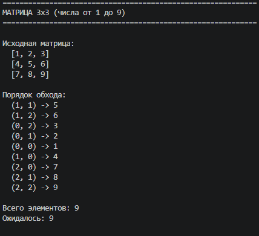
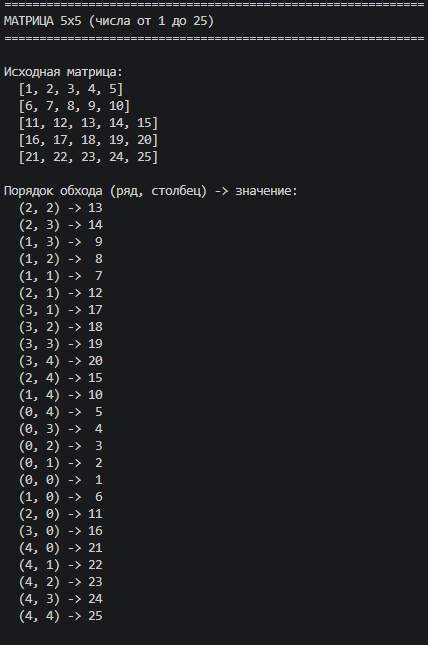
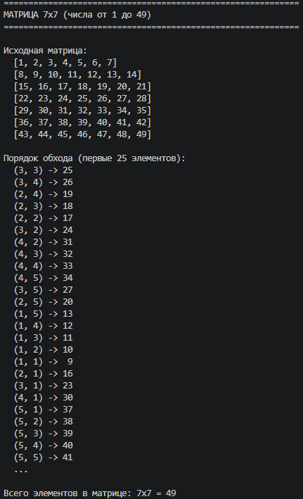
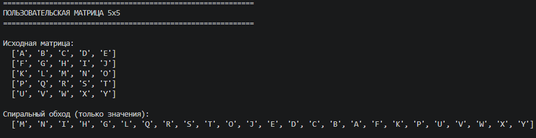
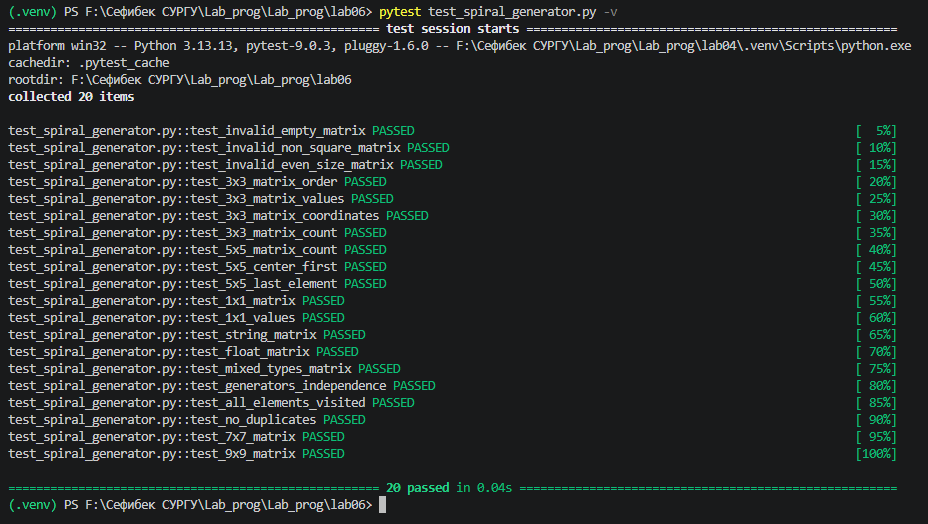

# Прог. Лабораторная работа №6
Генераторы

## Задания для самостоятельного выполнения

### **Сложность**:    *Rare*

1. Решите задачу своего варианта.

2. Оформите отчёт в README.md. Отчёт должен содержать:
- Условия задач
- Описание проделанной работы
- Скриншоты результатов
- Ссылки на используемые материалы

### **Сложность**:      *Medium*

- Напишите для генератора тесты с помощью pytest

### Варианты заданий

12. Генератор, который обходит элементы матрицы по спирали, начиная с центра в указанном направлении (не все матрицы можно так обойти).

## Ход работы:

### 1. Написание программ 

- отчёт выполнен в lab6

### 2. Алгоритм спирального обхода

Спиральный обход от центра реализуется следующим образом:

1. Определение центра – для матрицы размером n×n (n – нечётное) центр находится по индексу n // 2

2. Начало обхода – возвращается центральный элемент

3. Движение по спирали – направления чередуются в порядке: вправо, вверх, влево, вниз

4. Увеличение шага – длина шага увеличивается после каждых двух направлений (1, 1, 2, 2, 3, 3, ...)

5. Завершение – при выходе за границы матрицы генератор прекращает работу

**Схема движения для матрицы 5×5:**

```text
Начало: центр (2, 2)
Шаг 1: → (2, 3)           [длина шага 1]
Шаг 2: ↑ (1, 3), ↑ (1, 2)  [длина шага 2]
Шаг 3: ← (1, 1), ← (1, 0)  [длина шага 2]
Шаг 4: ↓ (2, 0), ↓ (3, 0), ↓ (4, 0)  [длина шага 3]
...
```

### 3. Реализация генератора
```python
def spiral_from_center(matrix):
    """
    Генератор для обхода матрицы по спирали от центра.
    
    Args:
        matrix: Квадратная матрица нечётного размера
        
    Yields:
        tuple: (строка, столбец, значение)
    """
    # Проверка валидности входных данных
    if not matrix or not all(len(row) == len(matrix) for row in matrix):
        raise ValueError("Матрица должна быть квадратной")
    
    n = len(matrix)
    if n % 2 == 0:
        raise ValueError("Матрица должна быть нечётного размера")
    
    center = n // 2
    row, col = center, center
    
    # Первый элемент (центр)
    yield row, col, matrix[row][col]
    
    step_length = 1
    directions = [(0, 1), (-1, 0), (0, -1), (1, 0)]  # право, вверх, влево, вниз
    
    while True:
        for idx, (dr, dc) in enumerate(directions):
            for _ in range(step_length):
                row += dr
                col += dc
                if 0 <= row < n and 0 <= col < n:
                    yield row, col, matrix[row][col]
                else:
                    return
            if idx % 2 == 1:
                step_length += 1
```
### 4. Вспомогательные генераторы
Для удобства также реализованы дополнительные генераторы:

```python
def spiral_values(matrix):
    """Возвращает только значения элементов."""
    for _, _, value in spiral_from_center(matrix):
        yield value

def spiral_coordinates(matrix):
    """Возвращает только координаты элементов."""
    for row, col, _ in spiral_from_center(matrix):
        yield row, col
```

## Результаты выполнения

1. Матрица 3×3 (числа от 1 до 9)


2. Матрица 5×5 (числа от 1 до 25)


3. Матрица 7×7 (числа от 1 до 49)


4. Пользовательская матрица 5×5 (буквы)



## Тестирование (уровень Medium)

1. Запуск тестов
```bash
pytest test_spiral_generator.py -v
```

2. Результат тестирования


3. Список тестов

### 5.3. Список тестов

| № | Название теста | Описание | Результат |
|:-:|----------------|----------|:---------:|
| 1 | `test_invalid_empty_matrix` | Проверка обработки пустой матрицы | ✅ PASSED |
| 2 | `test_invalid_non_square_matrix` | Проверка обработки неквадратной матрицы | ✅ PASSED |
| 3 | `test_invalid_even_size_matrix` | Проверка обработки матрицы чётного размера | ✅ PASSED |
| 4 | `test_3x3_matrix_order` | Проверка порядка обхода матрицы 3×3 | ✅ PASSED |
| 5 | `test_3x3_matrix_values` | Проверка получения значений для 3×3 | ✅ PASSED |
| 6 | `test_3x3_matrix_coordinates` | Проверка получения координат для 3×3 | ✅ PASSED |
| 7 | `test_3x3_matrix_count` | Проверка количества элементов 3×3 | ✅ PASSED |
| 8 | `test_5x5_matrix_count` | Проверка количества элементов 5×5 | ✅ PASSED |
| 9 | `test_5x5_center_first` | Проверка, что первым идёт центр | ✅ PASSED |
| 10 | `test_5x5_last_element` | Проверка последнего элемента 5×5 | ✅ PASSED |
| 11 | `test_1x1_matrix` | Проверка матрицы 1×1 | ✅ PASSED |
| 12 | `test_1x1_values` | Проверка значений для 1×1 | ✅ PASSED |
| 13 | `test_string_matrix` | Проверка матрицы строковых элементов | ✅ PASSED |
| 14 | `test_float_matrix` | Проверка матрицы вещественных чисел | ✅ PASSED |
| 15 | `test_mixed_types_matrix` | Проверка матрицы смешанных типов | ✅ PASSED |
| 16 | `test_generators_independence` | Проверка независимости генераторов | ✅ PASSED |
| 17 | `test_all_elements_visited` | Проверка посещения всех элементов | ✅ PASSED |
| 18 | `test_no_duplicates` | Проверка отсутствия дубликатов | ✅ PASSED |
| 19 | `test_7x7_matrix` | Проверка матрицы 7×7 | ✅ PASSED |
| 20 | `test_9x9_matrix` | Проверка матрицы 9×9 | ✅ PASSED |


# Список использованных материалов
Генераторы в Python — https://docs.python.org/3/tutorial/classes.html#generators

yield expression — https://docs.python.org/3/reference/expressions.html#yieldexpr

pytest documentation — https://docs.pytest.org/

Спиральный обход матрицы — https://en.wikipedia.org/wiki/Spiral_matrix