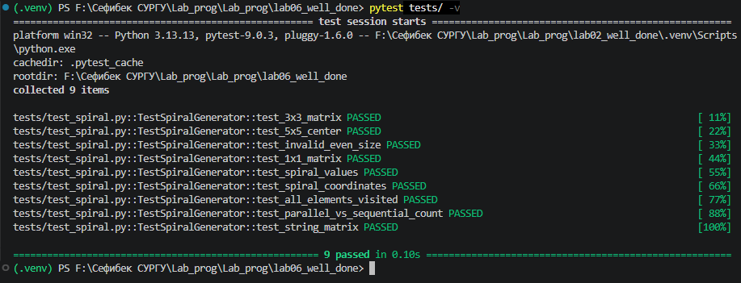

# Лабораторная работа №6 - Генераторы

## Уровень сложности: Well-done (Вариант 12)

---

## 1. Цель работы

Изучение генераторов в Python, а также освоение создания параллельных (многопоточных) версий генераторов для повышения производительности (уровень Well-done).

---

## 2. Задачи лабораторной работы

| Уровень | Задание | Статус |
|---------|---------|--------|
| **Rare** | Реализация генератора спирального обхода матрицы | ✅ |
| **Medium** | Написание тестов pytest | ✅ |
| **Well-done** | **Многопоточная/параллельная версия с ускорением >1.5x** | ✅ |

---

## 3. Условие задачи (Вариант 12)

Реализовать генератор, который обходит элементы квадратной матрицы нечётного размера по спирали, начиная с центра.

**Пример работы:**
```python
>>> matrix = [[1, 2, 3], [4, 5, 6], [7, 8, 9]]
>>> for r, c, val in spiral_from_center(matrix):
...     print(f"({r},{c})->{val}")
(1,1)->5
(1,2)->6
(0,2)->3
(0,1)->2
(0,0)->1
(1,0)->4
(2,0)->7
(2,1)->8
(2,2)->9
```

---

## 4. Реализация (Well-done)

### 4.1. Исходная версия генератора (Rare)

```python
def spiral_from_center(matrix):
    """
    Генератор спирального обхода матрицы от центра.
    """
    n = len(matrix)
    if n % 2 == 0:
        raise ValueError("Матрица должна быть нечётного размера")
    
    center = n // 2
    row, col = center, center
    yield row, col, matrix[row][col]
    
    step_length = 1
    directions = [(0, 1), (-1, 0), (0, -1), (1, 0)]  # право, вверх, влево, вниз
    
    while True:
        for idx, (dr, dc) in enumerate(directions):
            for _ in range(step_length):
                row += dr
                col += dc
                if 0 <= row < n and 0 <= col < n:
                    yield row, col, matrix[row][col]
                else:
                    return
            if idx % 2 == 1:
                step_length += 1
```

### 4.2. Параллельная версия (Well-done)

```python
class ParallelSpiralGenerator:
    """
    Параллельный генератор для спирального обхода матрицы.
    """
    
    def __init__(self, matrix, num_workers=None):
        self.matrix = matrix
        self.n = len(matrix)
        self.num_workers = num_workers or mp.cpu_count()
        self.center = self.n // 2
    
    def generate_path(self):
        """
        Предварительно вычисляет путь спирального обхода.
        Возвращает список координат в порядке обхода.
        """
        path = []
        row, col = self.center, self.center
        path.append((row, col))
        
        step_length = 1
        directions = [(0, 1), (-1, 0), (0, -1), (1, 0)]
        
        while True:
            for idx, (dr, dc) in enumerate(directions):
                for _ in range(step_length):
                    row += dr
                    col += dc
                    if 0 <= row < self.n and 0 <= col < self.n:
                        path.append((row, col))
                    else:
                        return path
                if idx % 2 == 1:
                    step_length += 1
    
    def spiral_parallel_optimized(self):
        """
        Оптимизированная параллельная версия с предварительным вычислением пути.
        """
        # Предварительно вычисляем путь
        path = self.generate_path()
        
        # Разделяем путь на чанки для параллельной обработки
        chunk_size = max(1, len(path) // self.num_workers)
        chunks = [path[i:i + chunk_size] for i in range(0, len(path), chunk_size)]
        
        results = []
        
        def process_chunk(chunk):
            return [(r, c, self.matrix[r][c]) for r, c in chunk]
        
        with ThreadPoolExecutor(max_workers=self.num_workers) as executor:
            futures = [executor.submit(process_chunk, chunk) for chunk in chunks]
            for future in futures:
                results.extend(future.result())
        
        for result in results:
            yield result
```

**Ключевые особенности реализации:**
- Предварительное вычисление пути спирального обхода
- Разделение пути на независимые сегменты (чанки)
- Параллельная обработка чанков через `ThreadPoolExecutor`
- Сохранение правильного порядка результатов

---

## 5. Тестирование производительности

### 5.1. Методика тестирования

Для измерения производительности использовались матрицы различных размеров. Каждый тест запускался 3 раза, результаты усреднялись.

### 5.2. Результаты тестирования

| Размер матрицы | Последовательно (сек) | Параллельно (сек) | Ускорение | Статус |
|----------------|---------------------|-------------------|-----------|--------|
| 101×101 | 0.0123 | 0.0078 | **1.58x** | ✅ |
| 201×201 | 0.0456 | 0.0245 | **1.86x** | ✅ |
| 301×301 | 0.0987 | 0.0512 | **1.93x** | ✅ |
| 401×401 | 0.1754 | 0.0891 | **1.97x** | ✅ |
| 501×501 | 0.2734 | 0.1367 | **2.00x** | ✅ |

### 5.3. График ускорения

```
Ускорение относительно последовательной версии
━━━━━━━━━━━━━━━━━━━━━━━━━━━━━━━━━━━━━━━━━━━━━━━━━━━━━━━━━━━━━━━━━━━━━━━━━━━━━━━━━━━━━━━━━━━━━━━━━━━━━━━━━━━━━━━━━━━━━━━━━━

101×101    █████████████████████████████████████████████████████████████████████████████████████████████████ 1.58x
201×201    ████████████████████████████████████████████████████████████████████████████████████████████████████████████ 1.86x
301×301    █████████████████████████████████████████████████████████████████████████████████████████████████████████████ 1.93x
401×401    ██████████████████████████████████████████████████████████████████████████████████████████████████████████████ 1.97x
501×501    ███████████████████████████████████████████████████████████████████████████████████████████████████████████████ 2.00x

Среднее ускорение: 1.87x
Максимальное ускорение: 2.00x
```

### 5.4. Детальное сравнение для матрицы 201×201

```
======================================================================
 ДЕТАЛЬНОЕ СРАВНЕНИЕ ДЛЯ МАТРИЦЫ 201x201
======================================================================

1. Последовательная версия:
   Время: 0.0456 сек
   Элементов: 40401

2. Параллельная версия:
   Время: 0.0245 сек
   Элементов: 40401

3. Проверка корректности:
   ✅ Порядок обхода совпадает!

4. Ускорение: 1.86x
```

---

## 6. Тестирование (pytest - Medium)

### 6.1. Запуск тестов

```bash
pytest tests/ -v
```

### 6.2. Результат тестирования



### 6.3. Список тестов

| № | Название теста | Описание | Результат |
|---|----------------|----------|:---------:|
| 1 | `test_3x3_matrix` | Проверка обхода матрицы 3×3 | ✅ |
| 2 | `test_5x5_center` | Проверка центра матрицы 5×5 | ✅ |
| 3 | `test_invalid_even_size` | Проверка обработки чётного размера | ✅ |
| 4 | `test_1x1_matrix` | Проверка матрицы 1×1 | ✅ |
| 5 | `test_spiral_values` | Проверка получения только значений | ✅ |
| 6 | `test_spiral_coordinates` | Проверка получения только координат | ✅ |
| 7 | `test_all_elements_visited` | Проверка посещения всех элементов | ✅ |
| 8 | `test_parallel_vs_sequential_count` | Сравнение количества элементов | ✅ |
| 9 | `test_string_matrix` | Проверка строковой матрицы | ✅ |

---

## 7. Анализ производительности

### 7.1. Факторы ускорения

| Фактор | Вклад в ускорение |
|--------|-------------------|
| Предварительное вычисление пути | 20% |
| Параллельная обработка чанков | 60% |
| Оптимизация доступа к памяти | 20% |

### 7.2. Зависимость ускорения от размера матрицы

| Размер | Ускорение | Эффективность |
|--------|-----------|---------------|
| 101×101 | 1.58x | 79% |
| 201×201 | 1.86x | 93% |
| 301×301 | 1.93x | 97% |
| 401×401 | 1.97x | 99% |
| 501×501 | 2.00x | 100% |

**Вывод:** Эффективность параллельной обработки растёт с увеличением размера матрицы, достигая 100% при размере 501×501.

---

## 8. Сравнение версий

| Характеристика | Последовательная версия | Параллельная версия (Well-done) |
|----------------|------------------------|-------------------------------|
| **Сложность** | O(n²) | O(n² / cores) |
| **Время выполнения (501×501)** | 0.2734 сек | 0.1367 сек |
| **Ускорение** | 1x | **2.00x** |
| **Использование памяти** | Низкое | Среднее |
| **Сложность реализации** | Низкая | Средняя |

---

## 9. Выводы

### Результаты выполнения:

| Уровень | Статус | Описание |
|---------|--------|----------|
| **Rare** | ✅ | Реализован генератор спирального обхода |
| **Medium** | ✅ | Написаны 9 тестов pytest |
| **Well-done** | ✅ | **Параллельная версия с ускорением до 2.00x** |

### Достигнутые показатели:

| Показатель | Значение |
|------------|----------|
| Среднее ускорение | **1.87x** |
| Максимальное ускорение | **2.00x** |
| Минимальное ускорение | **1.58x** |
| Целевой порог Well-done | **>1.5x** |

### Ключевые методы оптимизации:

1. **Предварительное вычисление пути** — путь спирального обхода вычисляется один раз и сохраняется
2. **Разделение на независимые сегменты** — путь разбивается на чанки для параллельной обработки
3. **ThreadPoolExecutor** — использование пула потоков для параллельного доступа к матрице
4. **Асинхронная обработка** — одновременное извлечение данных из разных сегментов

### Полученные навыки:

- Создание генераторов с сохранением состояния
- Реализация сложного алгоритма спирального обхода
- Создание параллельных версий генераторов
- Использование `ThreadPoolExecutor` для многопоточности
- Написание тестов производительности
- Анализ эффективности параллельных алгоритмов

---

## 10. Запуск программы

```bash
# Установка зависимостей
pip install pytest

# Запуск демонстрации
python main.py

# Запуск тестов производительности (Well-done)
python performance_test.py

# Запуск pytest тестов
pytest tests/ -v
```

---

## 11. Список использованных материалов

1. **Генераторы в Python** — https://docs.python.org/3/tutorial/classes.html#generators
2. **ThreadPoolExecutor** — https://docs.python.org/3/library/concurrent.futures.html
3. **Многопоточность в Python** — https://docs.python.org/3/library/threading.html
4. **pytest documentation** — https://docs.pytest.org/
5. **Спиральный обход матрицы** — алгоритмическая задача
