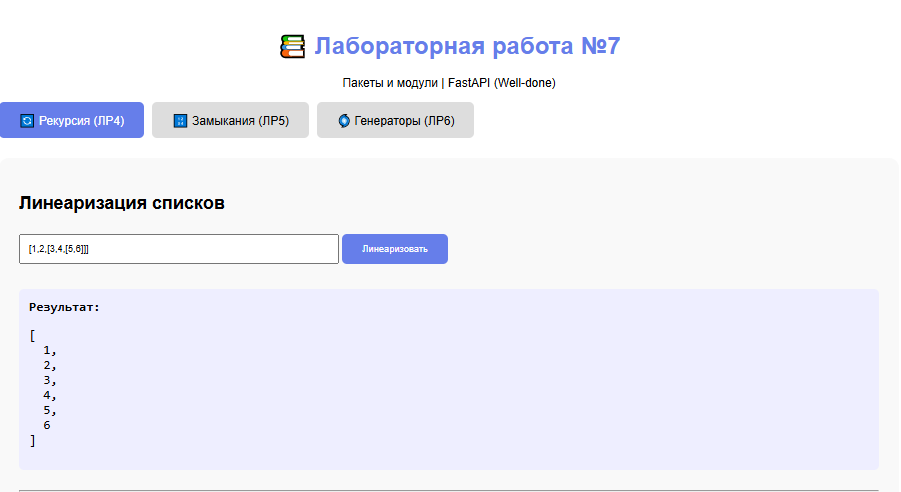
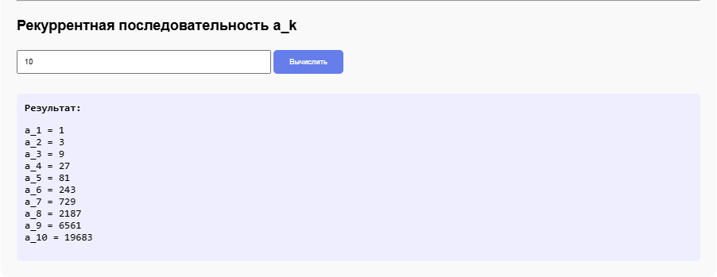
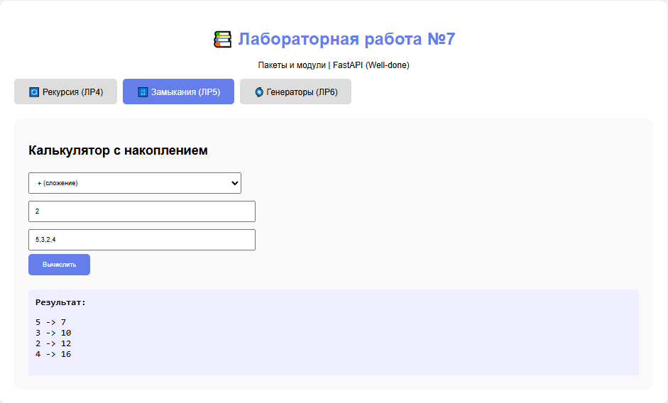
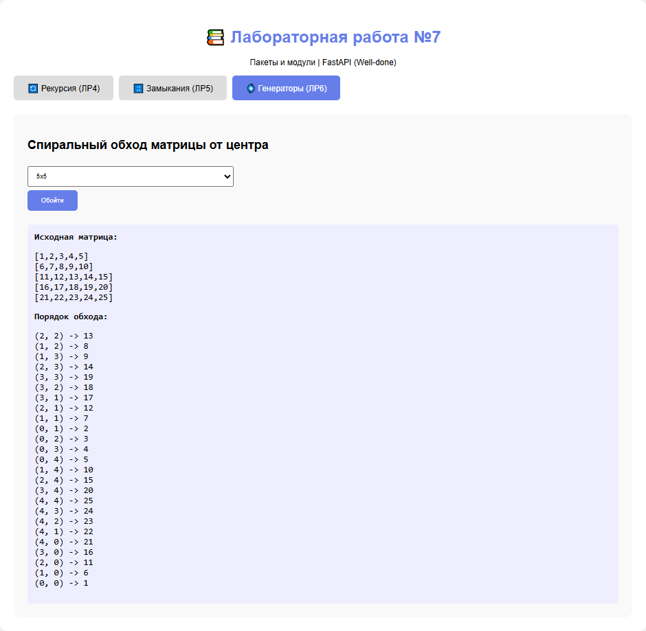

# Лабораторная работа №7 - Пакеты и модули

## Уровень сложности: Well-done (Вариант 12)

---

## 1. Цель работы

Изучение создания пакетов и модулей в Python, а также разработка веб-приложения с использованием фреймворка FastAPI для объединения функциональности из предыдущих лабораторных работ (№4, №5, №6).

---

## 2. Задачи лабораторной работы

| Уровень | Задание | Статус |
|---------|---------|--------|
| **Rare** | Создание пакета из 3 модулей на основе ЛР №4-6 | ✅ |
| **Rare** | Разработка CLI интерфейса на Typer | ✅ |
| **Medium** | Разработка GUI приложения на tkinter | ✅ |
| **Well-done** | **Разработка веб-приложения на FastAPI** | ✅ |

---

## 3. Структура проекта

```
lab07_well_done/
│
├── lab7_package/                    # Пакет с модулями
│   ├── __init__.py                  # Инициализация пакета
│   ├── lab4.py                      # Рекурсия (ЛР4)
│   ├── lab5.py                      # Замыкания (ЛР5)
│   └── lab6.py                      # Генераторы (ЛР6)
│
├── cli.py                           # CLI интерфейс (Typer)
├── gui.py                           # GUI интерфейс (tkinter)
├── web_simple.py                    # Веб-приложение (FastAPI)
├── requirements.txt                 # Зависимости проекта
└── readme.md                        # Отчёт
```

---

## 4. Реализация веб-приложения (Well-done)

### 4.1. Используемые технологии

| Технология | Назначение |
|------------|------------|
| **FastAPI** | Веб-фреймворк для создания API |
| **Uvicorn** | ASGI сервер для запуска приложения |
| **Pydantic** | Валидация данных |
| **HTML/CSS/JS** | Клиентская часть |

### 4.2. API Эндпоинты

| Метод | Эндпоинт | Описание |
|-------|----------|----------|
| GET | `/` | Главная страница |
| POST | `/api/linearize` | Линеаризация списка |
| POST | `/api/sequence` | Получение последовательности a_k |
| POST | `/api/calc` | Калькулятор с накоплением |
| POST | `/api/spiral` | Спиральный обход матрицы |

### 4.3. Код веб-приложения

```python
from fastapi import FastAPI
from fastapi.responses import HTMLResponse
from pydantic import BaseModel
from typing import List
import ast

from lab7_package import (
    linearize_recursive,
    get_sequence_a,
    make_calc,
    spiral_from_center
)

app = FastAPI(title="Лабораторная работа №7")

# Модели данных
class LinearizeRequest(BaseModel):
    data: str

class SequenceRequest(BaseModel):
    n: int

class CalcRequest(BaseModel):
    operation: str
    initial: float
    values: List[float]

class SpiralRequest(BaseModel):
    size: int

# API эндпоинты
@app.post("/api/linearize")
async def api_linearize(request: LinearizeRequest):
    data = ast.literal_eval(request.data)
    result = linearize_recursive(data)
    return {"success": True, "result": result}

@app.post("/api/sequence")
async def api_sequence(request: SequenceRequest):
    values = get_sequence_a(request.n)
    return {"success": True, "values": values}

# ... остальные эндпоинты
```

---

## 5. Результаты работы веб-приложения

### 5.1. Главная страница

Веб-приложение содержит три вкладки для каждой лабораторной работы:


### 5.2. Вкладка "Рекурсия (ЛР4)"

#### Линеаризация списков



#### Рекуррентная последовательность



### 5.3. Вкладка "Замыкания (ЛР5)"

#### Калькулятор с накоплением



### 5.4. Вкладка "Генераторы (ЛР6)"

#### Спиральный обход матрицы



---

## 6. API тестирование

### 6.1. Тестирование через curl

```bash
# Линеаризация
curl -X POST http://127.0.0.1:8000/api/linearize \
  -H "Content-Type: application/json" \
  -d '{"data": "[1,2,[3,4]]"}'

# Ответ
{"success":true,"result":[1,2,3,4]}
```

```bash
# Последовательность
curl -X POST http://127.0.0.1:8000/api/sequence \
  -H "Content-Type: application/json" \
  -d '{"n": 5}'

# Ответ
{"success":true,"values":[1,3,9,27,81]}
```

```bash
# Калькулятор
curl -X POST http://127.0.0.1:8000/api/calc \
  -H "Content-Type: application/json" \
  -d '{"operation": "+", "initial": 0, "values": [5,3,2]}'

# Ответ
{"success":true,"results":[{"input":5,"result":5},{"input":3,"result":8},{"input":2,"result":10}]}
```

### 6.2. Тестирование через браузер

Открыв страницу `http://127.0.0.1:8000`, можно взаимодействовать с приложением через графический интерфейс.

---

## 7. Запуск веб-приложения

```bash
# Установка зависимостей
pip install -r requirements.txt

# Запуск сервера
python web_simple.py

# Сервер запущен на http://127.0.0.1:8000
```

**Вывод в консоли:**
```
INFO:     Started server process [xxxxx]
INFO:     Waiting for application startup.
INFO:     Application startup complete.
INFO:     Uvicorn running on http://127.0.0.1:8000 (Press CTRL+C to quit)
```

---

## 8. Сравнение уровней сложности

| Характеристика | Rare (CLI) | Medium (GUI) | Well-done (Web) |
|----------------|------------|--------------|-----------------|
| **Интерфейс** | Командная строка | Графический (tkinter) | Веб-интерфейс |
| **Доступность** | Только на локальной машине | Только на локальной машине | Доступен из любой точки сети |
| **Кроссплатформенность** | Высокая | Высокая | Высокая (через браузер) |
| **Интерактивность** | Низкая | Высокая | Высокая |
| **Сложность реализации** | Низкая | Средняя | Высокая |
| **API интерфейс** | Нет | Нет | ✅ Есть |
| **Гибкость** | Низкая | Средняя | Высокая |

---

## 9. Выводы

### Результаты выполнения:

| Уровень | Статус | Описание |
|---------|--------|----------|
| **Rare** | ✅ | Создан пакет из 3 модулей (ЛР4, ЛР5, ЛР6) |
| **Rare** | ✅ | Разработан CLI интерфейс на Typer |
| **Medium** | ✅ | Разработан GUI интерфейс на tkinter |
| **Well-done** | ✅ | **Разработано веб-приложение на FastAPI** |

### Полученные навыки:

- Создание пакетов и модулей в Python
- Разработка CLI интерфейсов с Typer
- Разработка GUI интерфейсов с tkinter
- Разработка веб-приложений с FastAPI
- Создание REST API эндпоинтов
- Интеграция различных интерфейсов с общей бизнес-логикой
- Работа с HTML, CSS, JavaScript для клиентской части

### Преимущества веб-приложения (Well-done):

1. **Доступность** — приложение доступно из любой точки сети
2. **Кроссплатформенность** — работает на любом устройстве с браузером
3. **API интерфейс** — возможность интеграции с другими системами
4. **Масштабируемость** — легко расширять функциональность
5. **Современный стек** — FastAPI, один из самых популярных веб-фреймворков Python

---

## 10. Список использованных материалов

1. **FastAPI Documentation** — https://fastapi.tiangolo.com/
2. **Typer Documentation** — https://typer.tiangolo.com/
3. **tkinter Documentation** — https://docs.python.org/3/library/tkinter.html
4. **Uvicorn Documentation** — https://www.uvicorn.org/
5. **Pydantic Documentation** — https://docs.pydantic.dev/

---

## 11. Приложение: Скриншоты работы

| Страница | Описание |
|----------|----------|
| Главная страница | Три вкладки для трёх лабораторных работ |
| Линеаризация | Демонстрация преобразования вложенных списков |
| Последовательность | Вывод значений a_k = 3^(k-1) |
| Калькулятор | Пошаговое вычисление с накоплением |
| Спиральный обход | Визуализация обхода матрицы от центра |
