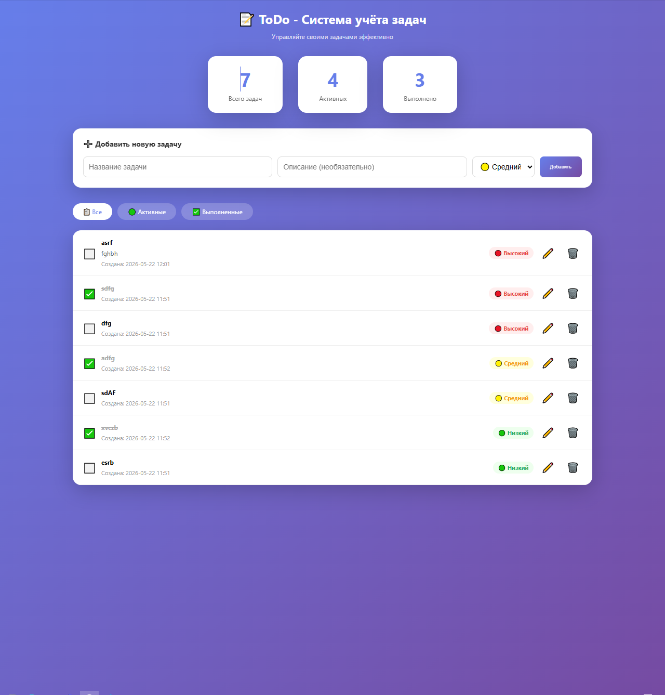
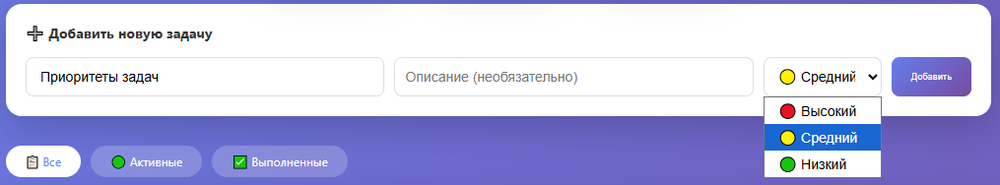

# Лабораторная работа №8 - Итоговый проект

## Уровень сложности: Well-done (Вариант 1 - ToDo)

---

## 1. Цель работы

Разработка полноценного приложения для управления задачами (ToDo-лист) с реализацией трёх уровней сложности:
- **Rare**: GUI приложение на tkinter
- **Medium**: Интеграция с базой данных SQLite
- **Well-done**: Веб-приложение на FastAPI

---

## 2. Задачи лабораторной работы

| Уровень | Задание | Статус |
|---------|---------|--------|
| **Rare** | GUI приложение (tkinter) | ✅ |
| **Medium** | Интеграция с БД SQLite | ✅ |
| **Well-done** | **Веб-приложение на FastAPI** | ✅ |

---

## 3. Структура проекта

```
lab08_well_done/
│
├── database.py          # Модуль работы с БД SQLite
├── todo_gui.py          # GUI приложение (tkinter)
├── web_app.py           # Веб-приложение (FastAPI)
├── todo.db              # База данных (создаётся автоматически)
├── requirements.txt     # Зависимости проекта
└── README.md            # Документация
```

---

## 4. Реализация (Well-done)

### 4.1. Модуль работы с БД (database.py)

```python
import sqlite3
from datetime import datetime
from typing import List, Dict, Optional

class TodoDatabase:
    """Класс для работы с базой данных задач."""
    
    def __init__(self, db_name: str = "todo.db"):
        self.db_name = db_name
        self._init_db()
    
    def _init_db(self):
        """Инициализация базы данных."""
        with sqlite3.connect(self.db_name) as conn:
            cursor = conn.cursor()
            cursor.execute("""
                CREATE TABLE IF NOT EXISTS tasks (
                    id INTEGER PRIMARY KEY AUTOINCREMENT,
                    title TEXT NOT NULL,
                    description TEXT,
                    status TEXT DEFAULT 'pending',
                    priority TEXT DEFAULT 'medium',
                    created_at TEXT DEFAULT CURRENT_TIMESTAMP,
                    completed_at TEXT
                )
            """)
            conn.commit()
    
    def add_task(self, title: str, description: str = "", priority: str = "medium") -> int:
        """Добавляет новую задачу."""
        ...
    
    def get_all_tasks(self) -> List[Dict]:
        """Возвращает все задачи, отсортированные по приоритету."""
        ...
    
    def update_task_status(self, task_id: int, status: str):
        """Обновляет статус задачи."""
        ...
    
    def delete_task(self, task_id: int):
        """Удаляет задачу."""
        ...
    
    def get_statistics(self) -> Dict:
        """Возвращает статистику по задачам."""
        ...
```

### 4.2. Веб-приложение (web_app.py)

```python
from fastapi import FastAPI, Request, Form
from fastapi.responses import HTMLResponse, RedirectResponse
from database import db

app = FastAPI(title="ToDo - Система учёта задач")

@app.get("/", response_class=HTMLResponse)
async def index(request: Request, filter: str = "all"):
    """Главная страница."""
    if filter == "active":
        tasks = db.get_active_tasks()
    elif filter == "completed":
        tasks = db.get_completed_tasks()
    else:
        tasks = db.get_all_tasks()
    
    stats = db.get_statistics()
    return templates.TemplateResponse("index.html", {...})

@app.post("/add")
async def add_task(title: str = Form(...), description: str = Form(""), priority: str = Form("medium")):
    """Добавляет новую задачу."""
    db.add_task(title, description, priority)
    return RedirectResponse(url="/", status_code=303)

@app.post("/toggle/{task_id}")
async def toggle_task(task_id: int):
    """Переключает статус задачи."""
    task = db.get_task(task_id)
    if task:
        new_status = "completed" if task['status'] == "pending" else "pending"
        db.update_task_status(task_id, new_status)
    return RedirectResponse(url="/", status_code=303)

@app.get("/delete/{task_id}")
async def delete_task(task_id: int):
    """Удаляет задачу."""
    db.delete_task(task_id)
    return RedirectResponse(url="/", status_code=303)
```

---

## 5. Результаты работы

### 5.1. Главная страница веб-приложения



### 5.2. Функциональные возможности

| Функция | Описание |
|---------|----------|
| **Добавление задачи** | Ввод названия, описания, выбор приоритета |
| **Редактирование** | Изменение всех полей задачи |
| **Удаление** | Удаление задачи с подтверждением |
| **Отметка о выполнении** | Переключение статуса задачи |
| **Фильтрация** | Просмотр всех/активных/выполненных задач |
| **Статистика** | Отображение количества задач |

### 5.3. Приоритеты задач



### 5.4. Статистика

Приложение отображает актуальную статистику:
- Общее количество задач
- Количество активных задач
- Количество выполненных задач

---

## 6. API Эндпоинты

| Метод | Эндпоинт | Описание |
|-------|----------|----------|
| GET | `/` | Главная страница |
| GET | `/?filter=active` | Фильтр активных задач |
| GET | `/?filter=completed` | Фильтр выполненных задач |
| POST | `/add` | Добавление задачи |
| POST | `/toggle/{id}` | Переключение статуса |
| GET | `/edit/{id}` | Страница редактирования |
| POST | `/edit/{id}` | Сохранение изменений |
| GET | `/delete/{id}` | Удаление задачи |

---

## 7. Запуск приложений

### 7.1. Установка зависимостей

```bash
pip install -r requirements.txt
```

### 7.2. GUI приложение (Rare)

```bash
python todo_gui.py
```

### 7.3. Веб-приложение (Well-done)

```bash
python web_app.py
```

Сервер запускается на `http://127.0.0.1:8000`

---

## 8. Сравнение уровней сложности

| Характеристика | Rare (GUI) | Medium (БД) | Well-done (Web) |
|----------------|------------|-------------|-----------------|
| **Интерфейс** | tkinter | tkinter + SQLite | FastAPI + HTML |
| **Хранение данных** | В памяти | SQLite | SQLite |
| **Доступность** | Локально | Локально | Локально через браузер |
| **API интерфейс** | Нет | Нет | ✅ Есть |
| **Интерактивность** | Высокая | Высокая | Высокая |
| **Сложность** | Средняя | Средняя | Высокая |

---

## 9. Выводы

### Результаты выполнения:

| Уровень | Статус | Описание |
|---------|--------|----------|
| **Rare** | ✅ | Разработано GUI приложение на tkinter |
| **Medium** | ✅ | Добавлена интеграция с БД SQLite |
| **Well-done** | ✅ | **Разработано веб-приложение на FastAPI** |

### Полученные навыки:

- Разработка GUI приложений с tkinter
- Работа с SQLite数据库
- Создание REST API с FastAPI
- HTML/CSS верстка для веб-интерфейса
- Обработка форм и маршрутизация
- Управление состоянием приложения

### Преимущества веб-приложения:

1. **Доступность** — через любой браузер
2. **Кроссплатформенность** — не зависит от ОС
3. **API интерфейс** — возможность интеграции
4. **Масштабируемость** — легко расширять функционал
5. **Современный стек** — FastAPI, один из самых быстрых веб-фреймворков

---

## 10. Список использованных материалов

1. **FastAPI Documentation** — https://fastapi.tiangolo.com/
2. **tkinter Documentation** — https://docs.python.org/3/library/tkinter.html
3. **SQLite Documentation** — https://www.sqlite.org/docs.html
4. **Uvicorn Documentation** — https://www.uvicorn.org/
5. **Python datetime** — https://docs.python.org/3/library/datetime.html
