# Отчёт по лабораторной работе №1
Основные типы и операции в Python

# Задание для самостоятельного выполнения

## Сложность:                  *Rare*
1. Скачайте архив и распакуйте его в свой репозиторий. В нём 11 заданий, которые вам нужно выполнить.

2. Оформите отчёт в README.md. По каждому из заданий - описание задачи, скриншот работы программы.

## Ход работы:
***Распаковал архив из 11 заданий***

### Задание 0
**Составить словарь словарей между городами**

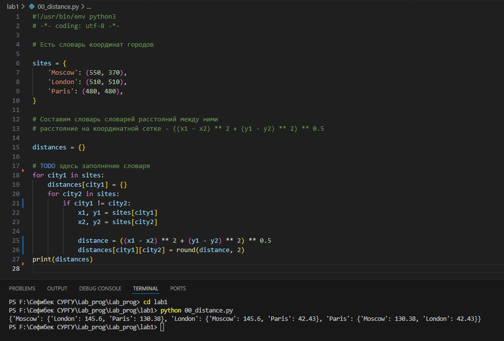
### Задание 1
**Вывел на консоль значение площади данного круга с точностю до 4-х знаков после запятой и решил задачу если точка внутри этого круга или за кругом**  

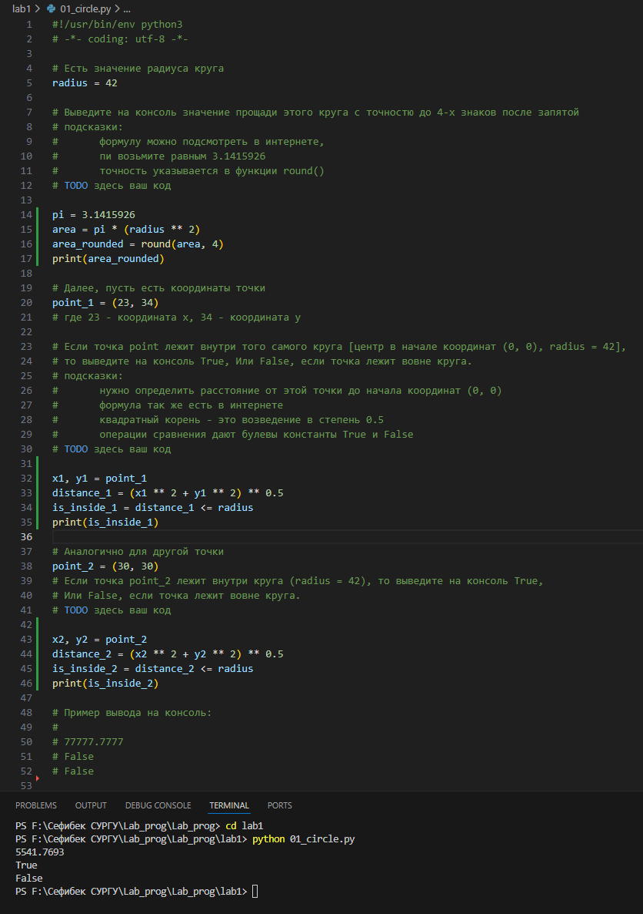
### Задание 2
**Расставил знаки операций "плюс", "минус", "умножение" и скобки**  

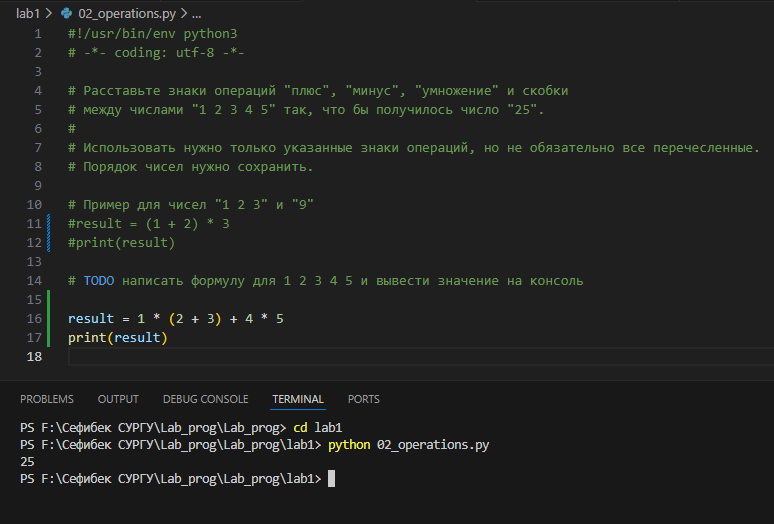
### Задание 3
**Вывел на консоль с помощью индексации строки**

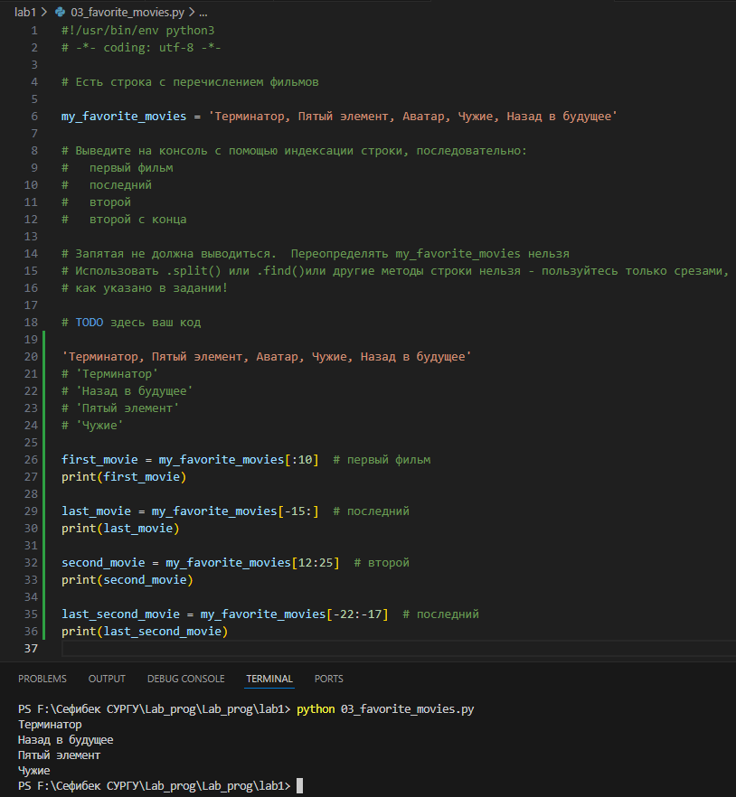
### Задание 4
**Создал список моей семьи, затем вывел рост отца и суммарный рост всей семьи**  

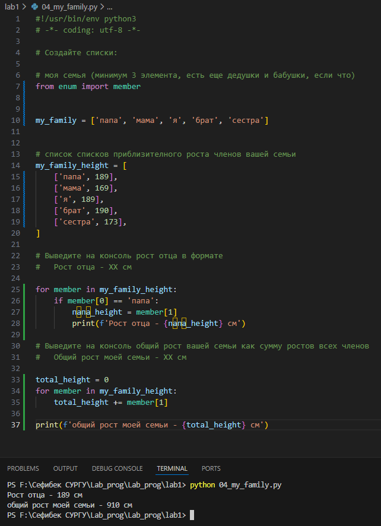
### Задание 5
**Посадил медведя (bear) между львом и кенгуру и вывел список на консоль. Добавил птиц из списка birds в последние клетки зоопарка.**  

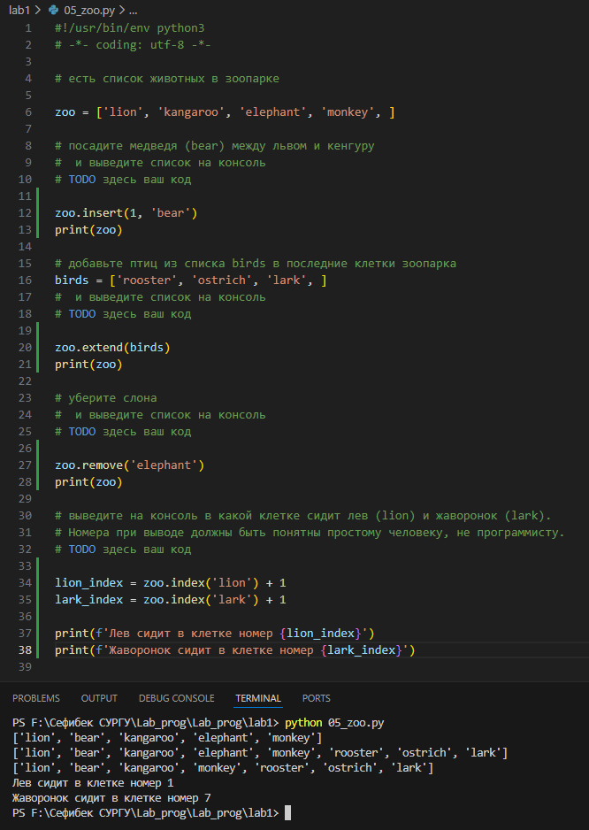
### Задание 6
**Вывел общее время звучания трех песен: 'Halo', 'Enjoy the Silence' и 'Clean' и распечатал общее время звучания трех песен: 'Sweetest Perfection', 'Policy of Truth' и 'Blue Dress**  

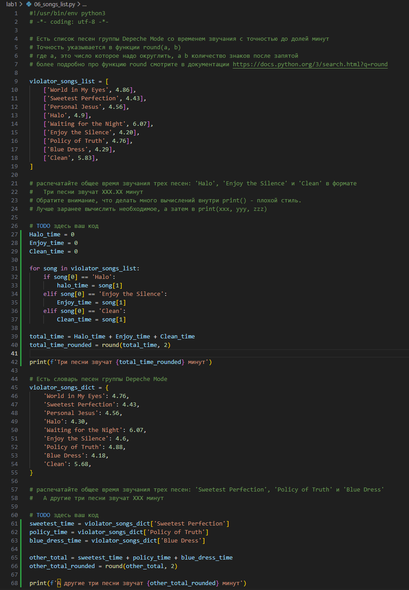

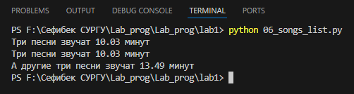
### Задание 7
**Расшифровал и вывел сообщение**  

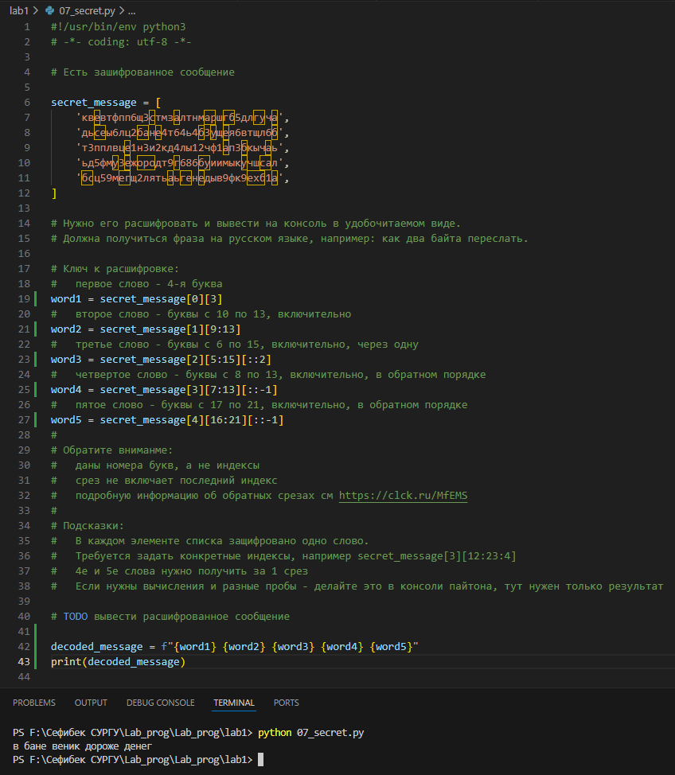
### Задание 8
**Создал множество цветов, произрастающих в саду и на лугу. Вывел на консоль все виды цветов. Вывел на консоль те, которые растут и там и там. Вывел на консоль те, которые растут в саду, но не растут на лугу. Вывел на консоль те, которые растут на лугу, но не растут в саду**  

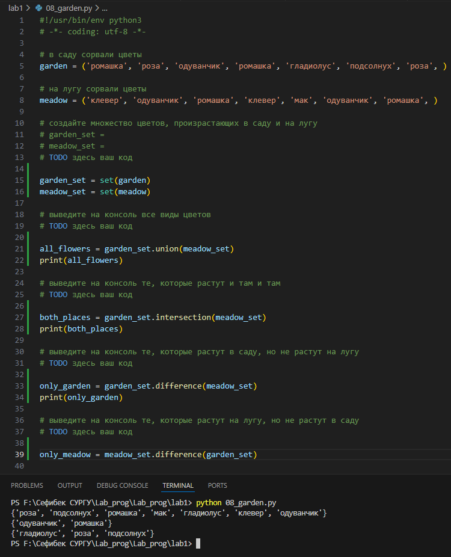
### Задание 9
**Создал словарь цен на продукты, указал 2 магазина с минимальными ценами**  

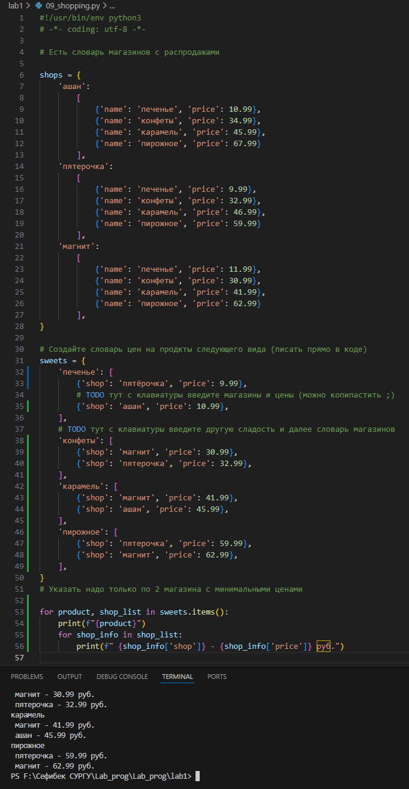
### Задание 10
**Рассчитал на какую сумму лежит каждого товара на складе. Вывел стоимость каждого вида товара на складе. Распечатал сколько всего столов и их общую стоимость. Распечатал сколько всего стульев и их общую стоимость**  

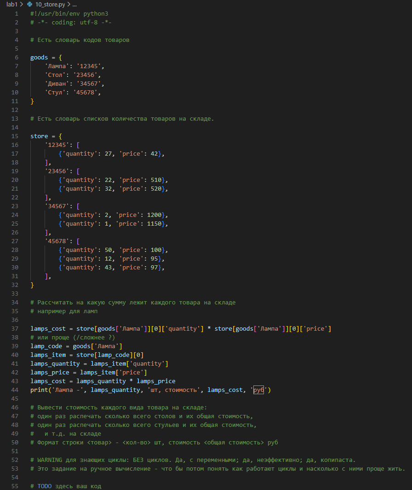

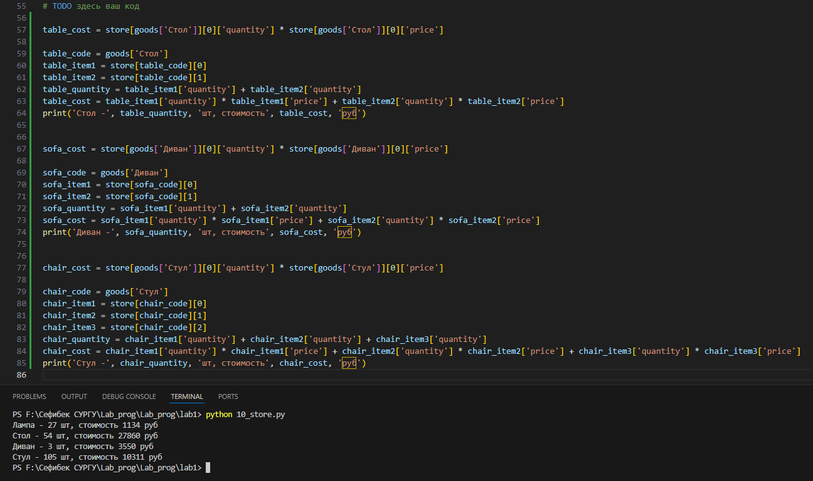
