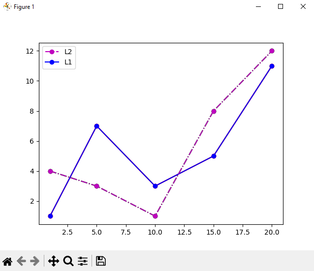

# Лаборатораня работа №2


## Задание для самостоятельного выполнения

### Сложность:                  *Rare*

1. Создайте в каталоге для данной ЛР в своём репозитории виртуальное окружение и установите в него matplotlib и numpy. Создайте файл requirements.txt.
2. Откройте книгу [1] и выполните уроки 1-3. Первый урок можно начинать со стр. 8.
3. Выберите одну из неразрывных функции своего варианта, постройте график этой функции и касательную к ней. Добавьте на график заголовок, подписи осей, легенду, сетку, а также аннотацию к точке касания.
4. Добавьте в корень своего репозитория файл .gitignore отсюда, перед тем как делать очередной коммит.
5. Оформите отчёт в README.md. Отчёт должен содержать:
    графики, построенные во время выполнения уроков из книги
    объяснения процесса решения и график по заданию 4
6. Склонируйте этот репозиторий НЕ в ваш репозиторий, а рядом. Изучите использование этого инструмента и создайте pdf-версию своего отчёта из README.md. Добавьте её в репозиторий.


## Ход работы

1. Cоздал “пустое” виртуальное окружение с помощью команды `python3 -m venv env` 
   Активировал виртуальное окружение командой `source env/bin/activate`
   Обновил пакетный менеджер командой `pip install -U pip`
   Установил необходимые пакеты с помощью команды `pip install 'пакеты'`
   Перенёс все установленные пакеты в новое окружение: `pip freeze > requirements.txt`
   Далее на “новом месте” создаЛ пустое окружение, обновил пакетный менеджер и затем выполнил `pip install -r requirements.txt`

2. Открыл книгу [1] и выполнил уроки 1-3.
3. Выполнил задание своего варианта
4. Добавил в корень своего репозитория файл .gitignore.

## Результат выполненной работы

### 1. Подготовка окружения
В соответствии с заданием было создано виртуальное окружение Python:

Terminal Python:

```python
# Создание виртуального окружения
python3 -m venv env

# Активация окружения
source env/bin/activate

# Установка необходимых пакетов
pip install matplotlib numpy

# Сохранение зависимостей
pip freeze > requirements.txt
```

Содержимое файла requirements.txt:

matplotlib==3.7.1
numpy==1.24.3

### 2. Выполнение уроков 1-3 из книги [1]

#### Урок 1: Основы работы с Matplotlib

##### 1.1: Быстрый старт

  Если вы пишете код в .py файле, а потом запускаете его через вызов
интерпретатора Python, то строка %matplotlib inline вам не нужна,
используйте только импорт библиотеки. Пример, аналогичный тому, что
представлен на рисунке выше, для отдельного Python-файла будет
выглядеть так:

```python
import matplotlib.pyplot as plt

plt.plot([1, 2, 3, 4, 5], [1, 2, 3, 4, 5])

plt.show()
```

В результате получите график в отдельном окне.


##### 1.2: Построение графика

Для начал построим простую линейную зависимость, дадим нашему
графику название, подпишем оси и отобразим сетку. Код программы:

```python
import matplotlib.pyplot as plt

# Независимая (x) и зависимая (y) переменные
x = np.linspace(0, 10, 50)
y = x

# Построение графика
plt.title('Линейная зависимость y = x')       # заголовок
plt.xlabel('x')                               # ось абсцисс
plt.ylabel('y')                               # ось ординат
plt.grid()                                    # включение отображение сетки
plt.plot(x, y)                                # построение графика

plt.show()
```

В результате получим следующий график:


###### 1.2.2

Изменим тип линии и ее цвет, для этого в функцию plot(), в качестве
третьего параметра, передадим строку, сформированную определенным
образом, в нашем случае это 'r--', где 'r' означает красный цвет, а
'--' - тип линии - пунктирная линия. Более подробно о том, как
задавать цвет и тип линии будет рассказано с одном из следующих
уроков.

```python
import matplotlib.pyplot as plt

# Построение графика
plt.title('Линейная зависимость y = x')       # заголовок
plt.xlabel('x')                               # ось абсцисс
plt.ylabel('y')                               # ось ординат
plt.grid()                                    # включение отображение сетки
plt.plot(x, y, 'r--')                         # построение графика

plt.show()
```

В результате получим следующий график:


##### 1.3: Несколько графиков на одном поле

Построим несколько графиков на одном поле, для этого добавим
квадратичную зависимость:

```python
import matplotlib.pyplot as plt

# Линейная зависимость
x = np.linspace(0, 10, 50)
y1 = x

# Квадратичная зависимость
y2 = [i**2 for i in x]

# Построение графика
plt.title('Зависимости: y1 = x, y2 = x^2')    # заголовок
plt.xlabel('x')                               # ось абсцисс
plt.ylabel('y1, y2')                          # ось ординат
plt.grid()                                    # включение отображение сетки
plt.plot(x, y1, x, y2)                        # построение графика

plt.show()
```

В результате получим следующий график:


##### 1.4: Представление графиков на разных полях

Третья, довольно часто встречающаяся задача - это отобразить два или
более различных поля, на которых будет отображено по одному или
более графику. Построим уже известные нам две зависимость на разных
полях:

```python
import matplotlib.pyplot as plt

# Линейная зависимость
x = np.linspace(0, 10, 50)
y1 = x

# Квадратичная зависимость
y2 = [i**2 for i in x]

# Построение графиков
plt.figure(figsize=(9, 9))
plt.subplot(2, 1, 1)
plt.plot(x, y1)                               # построение графика
plt.title('Зависимости: y1 = x, y2 = x^2')    # заголовок
plt.ylabel('y1', fontsize=14)                 # ось ординат
plt.grid(True)                                # включение отображение сетки
plt.subplot(2, 1, 2)
plt.plot(x, y2)                               # построение графика
plt.xlabel('x', fontsize=14)                  # ось абсцисс
plt.ylabel('y2', fontsize=14)                 # ось ординат
plt.grid(True)                                # включение отображение сетки

plt.show()
```
В результате получим следующий график:


##### 1.5: Построение диаграммы для категориальных данных

До этого мы строили графики для численных данных, то есть зависимая
и независимая переменные имели числовой тип. На практике довольно
часто приходится работать с данными не числовой природы - имена
людей, название городов и т. п. Построим диаграмму, на которой будет
отображаться количество фруктов в магазине:

```python
import matplotlib.pyplot as plt

fruits = ['apple', 'peach', 'orange', 'bannana', 'melon']
counts = [34, 25, 43, 31, 17]

plt.bar(fruits, counts)
plt.title('Fruits!')
plt.xlabel('Fruit')
plt.ylabel('Count')

plt.show()
```

В результате получим следующий график:


Для вывода диаграммы мы использовали функцию bar().

##### 1.6: Основные элементы графика

Рассмотрим основные термины и понятия, касающиеся изображения
графика, с которыми вам необходимо будет познакомиться, для того,
чтобы в дальнейшем у вас не было трудностей при изучении
представленных здесь уроков и документации по библиотеке Matplotlib.


Корневым элементом при построении графиков в системе Matplotlib
является Фигура (Figure). Все, что нарисовано на рисунке выше
является элементами фигуры. Рассмотрим ее составляющие более
подробно.

###### **График**
На рисунке представлены два графика - линейный и точечный.
Matplotlib предоставляет огромное количество различных настроек,
которые можно использовать для того, чтобы придать графику
требуемый вид: задать цвет, толщину, тип, стиль линии и многое
другое, все это мы рассмотрим в ближайших уроках.

###### **Оси**
Вторым, после непосредственно самого графика, по важности
элементом фигуры являются оси. Для каждой оси можно задать
метку (подпись), основные (major) и дополнительные (minor)
элементы шкалы, их подписи, размер, толщину и диапазоны.

###### **Сетка и легенда**
Сетка и легенда являются элементами фигуры, которые
значительно повышают информативность графика. Сетка может
быть основной (major) и дополнительной (minor). Каждому типу
сетки можно задавать цвет, толщину линии и тип. Для отображения
сетки и легенды используются соответствующие команды.

Ниже представлен код, с помощью которого была построена
фигура, изображенная на рисунке:

```python
import matplotlib.pyplot as plt
from matplotlib.ticker import (MultipleLocator, FormatStrFormatter,
AutoMinorLocator)
import numpy as np

x = np.linspace(0, 10, 10)

y1 = 4*x
y2 = [i**2 for i in x]

fig, ax = plt.subplots(figsize=(8, 6))
ax.set_title('Графики зависимостей: y1=4*x, y2=x^2', fontsize=16)
ax.set_xlabel('x', fontsize=14)
ax.set_ylabel('y1, y2', fontsize=14)
ax.grid(which='major', linewidth=1.2)
ax.grid(which='minor', linestyle='--', color='gray', linewidth=0.5)
ax.scatter(x, y1, c='red', label='y1 = 4*x')
ax.plot(x, y2, label='y2 = x^2')
ax.legend()
ax.xaxis.set_minor_locator(AutoMinorLocator())
ax.yaxis.set_minor_locator(AutoMinorLocator())
ax.tick_params(which='major', length=10, width=2)
ax.tick_params(which='minor', length=5, width=1)

plt.show()
```

#### Урок 2: Основы работы модулем pyplot

##### 2.1: Построение графиков

Основным элементом изображения, которое строит pyplot является
Фигура (Figure), на нее накладываются один или более графиков, осей,
надписей и т.д. Для построения графика используется команда plot(). В
самом минимальном варианте можно ее использовать без параметров:

```python
import matplotlib.pyplot as plt
%matplotlib inline

plt.plot()

plt.show()
```

В результате будет выведено пустое поле:


Далее команду импорта и magic-команду для Jupyter (первая и вторая
строки приведенной выше программы) мы не будем указывать.

Если в качестве параметра функции plot() передать список, то
значения из этого списка будут отложены по оси ординат (ось y), а по оси
абсцисс (ось x) будут отложены индексы элементов массива:

```python
plt.plot([1, 7, 3, 5, 11, 1])
```


###### 2.1.1

Для того, чтобы задать значения по осям x и y необходимо в plot()
передать два списка:

```python
plt.plot([1, 5, 10, 15, 20], [1, 7, 3, 5, 11])
```
В результате получим следующий график:


##### 2.2: Легенда

Легенда будет размещена на графике, если вызвать функцию legend(),
в рамках данного урока мы не будем рассматривать аргументы этой
функции.

Разместим на уже знакомом нам графике необходимый набор подписей:

```python
x = [1, 5, 10, 15, 20]
y = [1, 7, 3, 5, 11]

plt.plot(x, y, label='steel price')
plt.title('Chart price', fontsize=15)
plt.xlabel('Day', fontsize=12, color='blue')
plt.ylabel('Price', fontsize=12, color='blue')
plt.legend()
plt.grid(True)
plt.text(15, 4, 'grow up!')

plt.show()
```

В результате получим следующий график:


##### 2.3: Стиль линии графика

Стиль линии графика задается через параметр linestyle, который
может принимать значения из приведенной ниже таблицы.

Таблица 2.1 — Стили линии линейного графика
Значение параметра        Описание
'-' или 'solid'           Непрерывная линия
'--' или 'dashed'         Штриховая линия
'-.' или 'dashdot'        Штрихпунктирная линия
':' или 'dotted'          Пунктирная линия
'None' или ' ' или ''     Не отображать линию

Стиль линии можно передать сразу после списков с координатами без
указания, что это параметр linestyle:

```python
x = [1, 5, 10, 15, 20]
y = [1, 7, 3, 5, 11]
plt.plot(x, y, '--')
```

В результате получим следующий график:


###### 2.3.1

Другой вариант - это воспользоваться функцией setp():

```python
x = [1, 5, 10, 15, 20]
y = [1, 7, 3, 5, 11]
line = plt.plot(x, y)
plt.setp(line, linestyle='--')
```

Результат будет тот же, что на рисунке выше.

Для того, чтобы вывести несколько графиков на одном поле необходимо
передать соответствующие наборы значений в функцию plot().

Построим несколько наборов данных и выведем их с использованием
различных стилей линии:

```python
x = [1, 5, 10, 15, 20]
y1 = [1, 7, 3, 5, 11]
y2 = [i*1.2 + 1 for i in y1]
y3 = [i*1.2 + 1 for i in y2]
y4 = [i*1.2 + 1 for i in y3]
plt.plot(x, y1, '-', x, y2, '--', x, y3, '-.', x, y4, ':')
```

В результате получим следующий график:


###### 2.3.2

Цвет линии графика задается через параметр color (или c, если
использовать сокращенный вариант). Значение может быть
представлено в одном из следующих форматов:
• RGB или RGBA кортеж значений с плавающей точкой в диапазоне
[0, 1] (пример: (0.1, 0.2, 0.3);
• RGB или RGBA значение в hex формате (пример: ‘#0a0a0a’);
• строковое представление числа с плавающей точкой в диапазоне
[0, 1] (определяет цвет в шкале серого) (пример: ‘0.7’);
• символ из набора: {'b', 'g', 'r', 'c', 'm', 'y', 'k', 'w'};
• имя цвета из палитры X11/CSS4;
• цвет из палитры xkcd (https://xkcd.com/color/rgb/), должен
начинаться с префикса 'xkcd:';
• цвет из набора Tableau Color (палитра T10), должен начинаться с
префикса 'tab:'.
Если цвет задается с помощью символа из набора {'b', 'g', 'r',
'c', 'm', 'y', 'k', 'w'}, то он может быть совмещен со стилем
линии в рамках параметра fmt функции plot(). Например: штриховая
красная линия будет задаваться так: ‘--r’, а штрих пунктирная зеленая
так ‘-.g’:

```python
x = [1, 5, 10, 15, 20]
y = [1, 7, 3, 5, 11]
plt.plot(x, y, '--r')
```

В результате получим следующий график:


###### 2.3.3

До этого момента мы работали только с линейными графиками, функция
plot() позволяет задать тип графика: линейный либо точечный. Для
точечного графика нужно указать маркер, который будет использоваться
для его вывода.
Приведем пару примеров:

```python
# точечный
plt.plot(x, y, 'ro')

# крестики
plt.plot(x, y, 'bx')
```

В результате получим следующий график:


###### 2.4: Работа с функцией subplot()

Самый простой способ представить графики на отдельных полях - это
использовать функцию subplot() для задания их мест размещения. До
этого момента мы не работали с Фигурой (Figure) напрямую, значения ее
параметров, задаваемые по умолчанию нас устраивали. Для решения
текущей задачи придется один из параметров - размер подложки, задать
вручную. За это отвечает аргумент figsize функции figure(), которому
присваивается кортеж из двух float элементов, определяющих высоту и
ширину подложки.

После задания размера, указывается местоположение: куда будет
установлено поле с графиком с помощью функции subplot().
Доступны следующие варианты вызова subplot():

subplot(nrows, ncols, index)
• nrows: int
◦ Количество строк.
• ncols: int
◦ Количество столбцов.
• index: int
◦ Местоположение элемента.

subplot(pos)
• pos: int
◦ Позиция. Задается в виде трехзначного числа, содержащего
информацию о количестве строк, столбцов и индексе, например:
число 212 означает: подготовить разметку с двумя строками и
одним столбцом, элемент вывести в первую позицию второй
строки.

Второй вариант можно использовать, если количество строк и столбцов
сетки не более 10, в ином случае, лучше обратиться к первому варианту.
Рассмотрим на примере работу с данными функциями:

```python
# Исходный набор данных
x = [1, 5, 10, 15, 20]
y1 = [1, 7, 3, 5, 11]
y2 = [i*1.2 + 1 for i in y1]
y3 = [i*1.2 + 1 for i in y2]
y4 = [i*1.2 + 1 for i in y3]

# Настройка размеров подложки
plt.figure(figsize=(12, 7))

# Вывод графиков
plt.subplot(2, 2, 1)
plt.plot(x, y1, '-')
plt.subplot(2, 2, 2)
plt.plot(x, y2, '--')
plt.subplot(2, 2, 3)
plt.plot(x, y3, '-.')
plt.subplot(2, 2, 4)
plt.plot(x, y4, ':')
```

В результате получим следующий график:


Второй вариант использования subplot() будет выглядеть так:

```python
# Вывод графиков
plt.subplot(221)
plt.plot(x, y1, '-')
plt.subplot(222)
plt.plot(x, y2, '--')
plt.subplot(223)
plt.plot(x, y3, '-.')
plt.subplot(224)
plt.plot(x, y4, ':')
```

###### 2.4.1

Неудобство использования последовательного вызова функций
subplot() заключается в том, что каждый раз приходится указывать
количество строк и столбцов сетки. Для того, чтобы этого избежать,
можно воспользоваться функцией subplots(), из всех ее параметров
нас интересуют только первые два, через них передается количество
строк и столбцов сетки. Функция subplots() возвращает два объекта,
первый - это Figure, подложка, на которой будут размещены поля с
графиками, второй - объект (или массив объектов) Axes, через который
можно получить полных доступ к настройке внешнего вида
отображаемых элементов.

Решим задачу вывода четырех графиков с помощью функции
subplots():

```python
fig, axs = plt.subplots(2, 2, figsize=(12, 7))
axs[0, 0].plot(x, y1, '-')
axs[0, 1].plot(x, y2, '--')
axs[1, 0].plot(x, y3, '-.')
axs[1, 1].plot(x, y4, ':')
```

В результате получим следующий график:


#### Урок 3: Отображение легенды

##### 3.1

Для отображения легенды на графике используется функция legend().
Возможны следующие варианты ее вызова:

legend()
legend(labels)
legend(handles, labels)

В первом варианте, в качестве меток для легенды, будут использоваться
метки, указанные в функциях построения графиков (параметр label):

```python
x = [1, 5, 10, 15, 20]
y1 = [1, 7, 3, 5, 11]
y2 = [4, 3, 1, 8, 12]
plt.plot(x, y1, 'o-r', label='line 1')
plt.plot(x, y2, 'o-.g', label='line 1')
plt.legend()
```

В результате получим следующий график:



Второй вариант позволяет самостоятельно указать текстовую метку для
отображаемых данных:

```python
plt.plot(x, y1, 'o-r')
plt.plot(x, y2, 'o-.g')
plt.legend(['L1', 'L2'])
```

В третьем варианте можно вручную указать соответствие линий и меток:

```python
line1, = plt.plot(x, y1, 'o-b')
line2, = plt.plot(x, y2, 'o-.m')
plt.legend((line2, line1), ['L2', 'L1'])
```

###### 3.1.1

Место расположения легенды определяется параметром loc, которой
может принимать одно из значений, указанных в таблице 3.1.
Таблица 3.1 — Параметры расположения легенды на графике
Строковое описание          Код
'best'                      0
'upper right'               1
'upper left'                2
'lower left'                3
'lower right'               4
'right'                     5
'center left'               6
'center right'              7
'lower center'              8
'upper center'              9
'center'                    10

Ниже представлен пример, демонстрирующий различные варианты
расстановки легенды через параметр loc:

```python
locs = ['best', 'upper right', 'upper left', 'lower left',
        'lower right', 'right', 'center left', 'center right',
        'lower center', 'upper center', 'center']
plt.figure(figsize=(12, 12))
for i in range(3):
  for j in range(4):
    if i*4+j < 11:
      plt.subplot(3, 4, i*4+j+1)
      plt.title(locs[i*4+j])
      plt.plot(x, y1, 'o-r', label='line 1')
      plt.plot(x, y2, 'o-.g', label='line 2')
      plt.legend(loc=locs[i*4+j])
    else:
      break
```

В результате получим следующий график:


###### 3.1.2

В таблице 3.2 представлены дополнительные параметры, которые
можно использовать для более тонкой настройки легенды.


Пример работы с параметрами:

```py
plt.plot(x, y1, 'o-r', label='line 1')
plt.plot(x, y2, 'o-.g', label='line 1')
plt.legend(fontsize=14, shadow=True, framealpha=1, facecolor='y',
edgecolor='r', title='Легенда')
```

В результате получим следующий график:


##### 3.2: Инструмент GridSpec

Класс GridSpec, позволяет задавать геометрию сетки и расположение на
ней полей с графиками. На первый взгляд может показаться, что работа
с GridSpec довольно неудобна и требует написания лишнего кода, но,
если требуется расположить поля с графиками нетривиальным образом,
то этот инструмент становится незаменимым. Перед тем как работать с
GridSpec импортируйте его:
```py
import matplotlib.gridspec as gridspec
```
Для начала решим простую задачу отображения двух полей с графиками
с использованием GridSpec:

```py
x = [1, 2, 3, 4, 5]
y1 = [9, 4, 2, 4, 9]
y2 = [1, 7, 6, 3, 5]
fg = plt.figure(figsize=(7, 3), constrained_layout=True)
gs = gridspec.GridSpec(ncols=2, nrows=1, figure=fg)
fig_ax_1 = fg.add_subplot(gs[0, 0])
plt.plot(x, y1)
fig_ax_2 = fg.add_subplot(gs[0, 1])
plt.plot(x, y2)
```


###### 3.2.1

 Объект класса GridSpec, создается в строке:
```py
gridspec.GridSpec(ncols=2, nrows=1, figure=fg)
```
В конструктор класса передается количество столбцов, строк и Фигура,
на которой все будет отображено.
Альтернативный вариант создания объекта GridSpec выглядит так:
```py
gs = fg.add_gridspec(1, 2)
```
Здесь fg - это объект Figure, у которого есть метод add_gridspec(),
позволяющий добавить на него сетку с заданными параметрами (в
нашем случае одна строка и два столбца).
При задании элементов сетки, на которых будет расположено поле с
графиком, GridSpec позволяет использовать синтаксис подобный тому,
что применяется для построения слайсов в Numpy.
Добавим еще один набор данных к уже существующему:

```py
x = [1, 2, 3, 4, 5]
y1 = [9, 4, 2, 4, 9]
y2 = [1, 7, 6, 3, 5]
y3 = [-7, -4, 2, -4, -7]

#Построим графики в новой компоновке:
fg = plt.figure(figsize=(9, 4), constrained_layout=True)
gs = fg.add_gridspec(2, 2)
fig_ax_1 = fg.add_subplot(gs[0, :])
plt.plot(x, y2)
fig_ax_2 = fg.add_subplot(gs[1, 0])
plt.plot(x, y1)
fig_ax_3 = fg.add_subplot(gs[1, 1])
plt.plot(x, y3)
```


###### 3.2.2

Ниже представлен еще один пример, без данных (с пустыми полями),
который иллюстрирует возможности GridSpec:

```py
fg = plt.figure(figsize=(9, 9), constrained_layout=True)
gs = fg.add_gridspec(5, 5)
fig_ax_1 = fg.add_subplot(gs[0, :3])
fig_ax_1.set_title('gs[0, :3]')
fig_ax_2 = fg.add_subplot(gs[0, 3:])
fig_ax_2.set_title('gs[0, 3:]')
fig_ax_3 = fg.add_subplot(gs[1:, 0])
fig_ax_3.set_title('gs[1:, 0]')
fig_ax_4 = fg.add_subplot(gs[1:, 1])
fig_ax_4.set_title('gs[1:, 1]')
fig_ax_5 = fg.add_subplot(gs[1, 2:])
fig_ax_5.set_title('gs[1, 2:]')
fig_ax_6 = fg.add_subplot(gs[2:4, 2])
fig_ax_6.set_title('gs[2:4, 2]')
fig_ax_7 = fg.add_subplot(gs[2:4, 3:])
fig_ax_7.set_title('gs[2:4, 3:]')
fig_ax_8 = fg.add_subplot(gs[4, 3:])
fig_ax_8.set_title('gs[4, 3:]')
```


###### 3.2.3

Можно заранее задать размеры областей и передать их в качестве
параметров в виде массивов:

```py
fg = plt.figure(figsize=(5, 5),constrained_layout=True)
widths = [1, 3]
heights = [2, 0.7]
gs = fg.add_gridspec(ncols=2, nrows=2, width_ratios=widths,
height_ratios=heights)
fig_ax_1 = fg.add_subplot(gs[0, 0])
fig_ax_1.set_title('w:1, h:2')
fig_ax_2 = fg.add_subplot(gs[0, 1])
fig_ax_2.set_title('w:3, h:2')
fig_ax_3 = fg.add_subplot(gs[1, 0])
fig_ax_3.set_title('w:1, h:0.7')
fig_ax_4 = fg.add_subplot(gs[1, 1])
fig_ax_4.set_title('w:3, h:0.7')
```


##### 3.3: Текстовые элементы графика

В части текстового наполнения при построении графика выделяют
следующие составляющие:
• заголовок поля (title);
• заголовок фигуры (suptitle);
• подписи осей (xlabel, ylabel);
• тестовый блок на поле графика (text), либо на фигуре (figtext);
• аннотация (annotate) - текст и указатель.
У каждого элемента, который содержит текст, помимо специфических
параметров, отвечающих за его настройку, есть параметры класса Text,
которые открывают доступ к большому числу настроек внешнего вида и
расположения текстового элемента. Более подробно описание
параметров, доступных из класса Text, будет дано в “3.4 Свойства
класса Text”. Ниже представлен код, отображающий все указанные
выше текстовые элементы:

```py
plt.figure(figsize=(10,4))
plt.figtext(0.5, -0.1, 'figtext')
plt.suptitle('suptitle')
plt.subplot(121)
plt.title('title')
plt.xlabel('xlabel')
plt.ylabel('ylabel')
plt.text(0.2, 0.2, 'text')
plt.annotate('annotate', xy=(0.2, 0.4), xytext=(0.6, 0.7),
arrowprops=dict(facecolor='black', shrink=0.05))
plt.subplot(122)
plt.title('title')
plt.xlabel('xlabel')
plt.ylabel('ylabel')
plt.text(0.5, 0.5, 'text')
```


###### 3.3.1

Начнем с заголовка поля графика. Текст заголовка поля,
устанавливается с помощью функции title(), которая имеет
следующие основные аргументы:
• label: str
◦ Текст заголовка.
• fontdict: dict
◦ Словарь для управления отображением надписи, содержит
следующие ключи:
▪ 'fontsize': размер шрифта;
▪ 'fontweight': начертание;
▪ 'verticalalignment': вертикальное выравнивание;
▪ 'horizontalalignment': горизонтальное выравнивание.
• loc: {'center', 'left', 'right'}, str, optional
◦ Горизонтальное выравнивание.
• pad: float
◦ Зазор между заголовком и верхней частью поля графика.
Функция title() также поддерживает в качестве аргументов свойства
класса Text:

```py
weight=['light', 'regular', 'bold']
plt.figure(figsize=(12, 4))
for i, lc in enumerate(['left', 'center', 'right']):
 plt.subplot(1, 3, i+1)
 plt.title(label=lc, loc=lc, fontsize=12+i*5, fontweight=weight[i],
pad=10+i*15)
```


###### 3.3.2

При работе с pyplot, для установки подписей осей графика
используются функции labelx() и labely(), при работе с объектом
Axes - функции set_xlabel() и set_ylabel().
Основные аргументы функций почти полностью совпадают с теми, что
были описаны для функции title():
• label: str
◦ Текст подписи.
• fontdict: dict
◦ Словарь для управления отображением надписи, содержит
следующие ключи:
▪ 'fontsize': размер шрифта;
▪ 'fontweight': начертание;
▪ 'verticalalignment': вертикальное выравнивание;
▪ 'horizontalalignment': горизонтальное выравнивание.
• labelpad: float
◦ Зазор между подписью и осью.

В самом простом случае достаточно передать только подпись в виде
строки:

```py
# Пример 1
x = [i for i in range(10)]
y = [i*2 for i in range(10)]
plt.plot(x, y)
plt.xlabel('Ось X')
plt.ylabel('Ось Y')
```

Используем некоторые из дополнительных свойств для настройки
внешнего вида подписей осей:
```py
# Пример 2
plt.plot(x, y)
plt.xlabel('Ось X\nНезависимая величина', fontsize=14, fontweight='bold')
plt.ylabel('Ось Y\nЗависимая величина', fontsize=14, fontweight='bold')
```


###### 3.3.3

За установку текстовых блоков на поле графика отвечает функция
text(). Через основные параметры этой функции можно задать
расположение, содержание и настройки шрифта:
• x: float
◦ Значение координаты x надписи.
• y: float
◦ Значение координаты y надписи.
• s: str
◦ Текст надписи.

В простейшем варианте использование text() будет выглядеть так:

```py
# Пример 1
plt.text(0, 7, 'HELLO!', fontsize=15)
plt.plot(range(0,10), range(0,10))
```

Используем свойства класса Text для модификации этого
представления:

```py
# Пример 2
bbox_properties=dict(boxstyle='darrow, pad=0.3', ec='k', fc='y', ls='-',
lw=3)
plt.text(2, 7, 'HELLO!', fontsize=15, bbox=bbox_properties)
plt.plot(range(0,10), range(0,10))
```


###### 3.3.4

Инструмент Аннотация позволяет установить текстовый блок с заданным
содержанием и стрелкой для указания на конкретное место на графике.
Для создания аннотации используется функция annotate(), основными
ее аргументами являются:
• text: str
◦ Текст аннотации.
• xy: (float, float)
◦ Координаты места, на которое будет указывать стрелка.
• xytext: (float, float), optional
◦ Координаты расположения текстовой надписи.
• xycoords: str
◦ Система координат, в которой определяется расположение
указателя.
• textcoords: str
◦ Система координат, в которой определяется расположение
текстового блока.
• arrowprops: dict, optional
◦ Параметры отображения стрелки. Имена этих параметров
(ключи словаря) являются параметрами конструктора объекта
класса FancyArrowPatch.

Ниже представлен пример кода, который демонстрирует простой
вариант использования annotation():

```py
import math
x = list(range(-5, 6))
y = [i**2 for i in x]
plt.annotate('min', xy=(0, 0), xycoords='data', xytext=(0, 10),
textcoords='data', arrowprops=dict(facecolor='g'))
plt.plot(x, y)
```


###### 3.3.5

Рассмотрим настройку внешнего вида стрелки аннотации. За
конфигурирование отображения стрелки отвечает параметр arrowprops,
который принимает в качестве значения словарь, ключами которого
являются параметры конструктора класса FancyArrowPatch, из них
выделим два: arrowstyle отвечает за стиль стрелки и connectionstyle
- отвечает за стиль соединительной линии.

**Стиль стрелки**
Параметр: arrowstyle
Тип: str, ArrowStyle, optional
Доступные стили стрелок представлены в таблице 3.4 и на рисунке 3.18.


###### 3.3.6

Стиль соединительной линии

Параметр: connectionstyle
Тип: str, ConnectionStyle, None, optional
Через данный параметр можно задать описание стиля линии, которая
соединяет точки (xy, xycoords). В качестве значения данный параметр
может принимать объект класса ConnectionStyle, или строку, в которой
указывается стиль линии соединения с параметрами, перечисленными
через запятую.


Ниже представлен пример, который демонстрирует возможности работы
с параметром connectionstyle:

```py
import math

fig, axs = plt.subplots(2, 3, figsize=(12, 7))
conn_style=[
  'angle,angleA=90,angleB=0,rad=0.0',
  'angle3,angleA=90,angleB=0',
  'arc,angleA=0,angleB=0,armA=0,armB=40,rad=0.0',
  'arc3,rad=-1.0',
  'bar,armA=0.0,armB=0.0,fraction=0.1,angle=70',
  'bar,fraction=-0.5,angle=180',
]
for i in range(2):
  for j in range(3):
    axs[i, j].text(0.1, 0.5, '\n'.join(conn_style[i*3+j].split(',')))
    axs[i, j].annotate('text', xy=(0.2, 0.2), xycoords='data',
      xytext=(0.7, 0.8), textcoords='data',
      arrowprops=dict(arrowstyle='->',
connectionstyle=conn_style[i*3+j]))
```


##### 3.4: Свойства класса Text

Параметры, отвечающие за отображения текста
• alpha: float
◦ Уровень прозрачности надписи. Параметр задается числом в
диапазоне от 0 до 1. 0 - полная прозрачность, 1 - полная
непрозрачность.
• color: color
◦ Цвет текста. Значение параметра имеет тоже тип, что и
параметр функции plot, отвечающий за цвет графика.
• fontfamily (или family): str
◦ Шрифт текста, задается в виде строки из набора: {'serif',
'sans-serif', 'cursive', 'fantasy', 'monospace'}. Можно
использовать свой шрифт.
• fontsize (или size): str, int
◦ Размер шрифта, можно выбрать из ряда: {'xx-small', 'xsmall', 'small', 'medium', 'large', 'x-large', 'xxlarge'}, либо задать в виде численного значения.
• fontstyle (или style): str
◦ Стиль шрифта, задается из набора: {'normal', 'italic',
'oblique'}.
• fontvariant (или variant): str
◦ Начертание шрифта, задается из набора: {'normal', 'smallcaps'}.
• fontweight (или weight): str
◦ Насыщенность шрифта, задается из набора: {'ultralight',
'light', 'normal', 'regular', 'book', 'medium',
'roman', 'semibold', 'demibold', 'demi', 'bold',
'heavy', 'extra bold', 'black'} либо численным значением
в диапазоне 0-1000.

Рассмотрим пример, демонстрирующий использование перечисленных
выше параметров:

```py
plt.title('Title', alpha=0.5, color='r', fontsize=18, fontstyle='italic',
fontweight='bold', linespacing=10)
plt.plot(range(0,10), range(0,10))
```


###### 3.4.1

Для группового задания свойств можно использовать параметр
fontproperties или font_properties, которому в качестве значения
передается объект класса font_manager.FontProperties. Конструктор
класса FontProperties выглядит так:
```py
FontProperties(family=None, style=None, variant=None, weight=None,
stretch=None, size=None, fname=None)
```
• family
◦ Имя шрифта.
• style
◦ Стиль шрифта.
• variant
◦ Начертание.
• stretch
◦ Ширина шрифта.
• weight
◦ Насыщенность шрифта.
• size
◦ Размер шрифта.
Типы параметров конструктора такие же как у параметров, отвечающих
за отображение шрифта. Не забудьте предварительно импортировать
FontProperties прежде, чем его использовать:
```py
from matplotlib.font_manager import FontProperties
plt.title('Title', fontproperties=FontProperties(family='monospace',
style='italic', weight='heavy', size=15))
plt.plot(range(0,10), range(0,10))
```


###### 3.4.2

Параметры, отвечающие за расположение надписи

Для надписи можно задать выравнивание, позицию, вращение и zпорядок:
• horizontalalignment (или ha): str
◦ Горизонтальное выравнивание. Задается из набора: {'center',
'right', 'left'}.
• verticalalignment (или va): str
◦ Вертикальное выравнивание. Задается из набора {'center',
'top', 'bottom', 'baseline', 'center_baseline'}.
• position: (float, float)
◦ Позиция надписи. Определяется двумя координатами x и y,
которые передаются в параметр position в виде кортежа из
двух элементов.
• rotation: float или str
◦ Вращение. Ориентацию надписи можно задать в виде текста
{'vertical', 'horizontal'} либо численно - значением в
градусах.
• rotation_mode: str
◦ Режим вращения. Данный параметр определяет очередность
вращения и выравнивания. Если он равен 'default', то
вначале производится вращение, а потом выравнивание. Если
равен 'anchor', то наоборот.
• zorder: float
◦ Порядок расположения. Значение параметра определяет
очередность вывода элементов. Элемент с минимальным
значением zorder выводится первым.

Рассмотрим на примере заголовка использование параметров задания
расположения:
```py
plt.title('Title', fontsize=17, position=(0.7, 0.2), rotation='vertical')
plt.plot(range(0,10), range(0,10))
```


###### 3.4.3

• backgroundcolor: color
◦ Цвет заднего фона.

Если требуется более тонкая настройка с указанием цвета, толщины,
типа рамки, цвета основной заливки и т.п., то используйте параметр
bbox, его значение - это словарь, ключами которого являются свойства
класса patches.FancyBboxPatch (см. таблицу 3.5).


Пример оформления заднего фона надписи:

```py
from matplotlib.patches import FancyBboxPatch
bbox_properties=dict(
  boxstyle='rarrow, pad=0.3',
  ec='g',
  fc='r',
  ls='-',
  lw=3
)
plt.title('Title', fontsize=17, bbox=bbox_properties, position=(0.5,
0.85))
plt.plot(range(0,10), range(0,10))
```


##### 3.5: Цветовая полоса — Colorbar

Если вы строите цветовое распределение с использованием
colormesh(), pcolor(), imshow() и т.п., то для отображения
соответствия цвета и численного значения вам может понадобится
аналог легенды, который в Matplotlib называется colorbar. Создадим
случайное распределение с помощью np.random.rand():

```py
import numpy as np
np.random.seed(123)
vals = np.random.randint(10, size=(7, 7))
plt.pcolor(vals)
```

Для данного набора построим colorbar с помощью соответствующей
функции:

```py
np.random.seed(123)
vals = np.random.randint(10, size=(7, 7))
plt.pcolor(vals)
plt.colorbar()
```

Для дискретного разделения цветов на цветовой полосе, нужно при
построении изображения в соответствующую функцию (в нашем случае
pcolor()) через параметр cmap передать требуемую цветовую схему:

```py
np.random.seed(123)
vals = np.random.randint(10, size=(7, 7))
plt.pcolor(vals, cmap=plt.get_cmap('viridis', 11) )
plt.colorbar()
```


###### 3.5.1

Одни из вариантов более тонкой настройки цветовой полосы - это
создать на базе родительского Axes элемента свой и модифицировать
часть его параметров. Удобно сделать это с помощью функции
inset_axes() из mpl_toolkits.axes_grid1.inset_locator. Основные
ее аргументы перечислены в таблице 3.7.


Продемонстрируем работу с inset_axes() на примере:

```py
from mpl_toolkits.axes_grid1.inset_locator import inset_axes
np.random.seed(123)
vals = np.random.randint(11, size=(7, 7))
fig, ax = plt.subplots()
gr = ax.pcolor(vals)
axins = inset_axes(ax, width="7%", height="50%", loc='lower left',
bbox_to_anchor=(1.05, 0., 1, 1), bbox_transform=ax.transAxes,
borderpad=0)
plt.colorbar(gr, cax=axins)
```


###### 3.5.2

Для задания собственной шкалы необходимо передать соответствующий
список в функцию colorbar() через параметр ticks. Надпись на шкале,
устанавливается с помощью параметра label функции colorbar().
Модифицируйте последнюю строку из предыдущего примера
следующим образом:

```py
plt.colorbar(gr, cax=axins, ticks=[0, 5, 10], label='Value')
```


###### 3.5.3

Если есть необходимость в установке текстовых надписей, то
воспользуйтесь функцией set_yticklabels():

```py
cbar = plt.colorbar(gr, cax=axins, ticks=[0, 5, 10], label='Value')
cbar.ax.set_yticklabels(['Low', 'Medium', 'High'])
```


###### 3.5.4

Дополнительные параметры настройки colorbar
Рассмотрим ряд параметров для настройки внешнего вида colorbar,
которые доступны как аргументы соответствующей функции colorbar().


```py
import numpy as np

np.random.seed(123)
vals = np.random.randint(10, size=(7, 7))
plt.pcolor(vals, cmap=plt.get_cmap('viridis', 11))
plt.colorbar(orientation='horizontal',
  shrink=0.9, extend='max', extendfrac=0.2,
  extendrect=False, drawe
```


