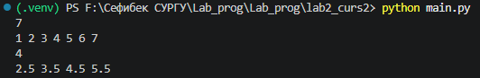
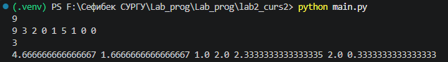
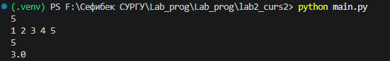
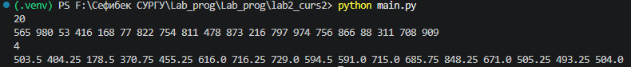

# Лабораторная работа №2

## Задание

Дана статистика по числу запросов в секунду к некоторому вебсервису. Измерения велись n секунд. В секунду i поступает qi запросов.
Примените метод скользящего среднего с длиной окна k к этим данным
и выведите результат.

## Формат ввода

В первой строке передаётся натуральное число n, количество
секунд, в течение которых велись измерения (1 ≤ n ≤ 105). Во второй
строке через пробел записаны n целых неотрицательных чисел qi,
каждое лежит в диапазоне от 0 до 103. В третьей строке записано
натуральное число k (1 ≤ k ≤ n) – окно сглаживания.


## Формат вывода

Выведите через пробел результат применения метода
скользящего среднего к серии измерений. Должно быть
выведено n−k+1 элементов, каждый элемент — вещественное число.

## Решение и ответ

### Код

```py
n = int(input())
q = list(map(int, input().split()))
k = int(input())

window_sum = sum(q[:k])
result = [window_sum / k]

for i in range(k, n):
    window_sum += q[i] - q[i - k]
    result.append(window_sum / k)

print(*result)
```

1. Читает входные данные

```py
n = int(input())                       # сколько всего секунд
q = list(map(int, input().split()))    # сами значения q₁..qₙ
k = int(input())                       # длина окна сглаживания
```

n — размер массива,
q — список чисел,
k — сколько элементов попадает в одно окно.

2. Считает среднее для самого первого окна

```py
window_sum = sum(q[:k])       # сумма первых k элементов
result = [window_sum / k]     # их среднее — первое число ответа
```

Например, при q = [1,2,3,4,...] и k = 4: window_sum = 1+2+3+4 = 10, первое среднее = 10/4 = 2.5.

3. «Скользит» окном по массиву и считает средние для остальных окон
```py
for i in range(k, n):
    window_sum += q[i] - q[i - k]     # обновляем сумму за O(1)
    result.append(window_sum / k)     # новое среднее — в ответ
```

Здесь применяется главный приём — скользящая сумма:

q[i] — элемент, который входит в окно справа,
q[i - k] — элемент, который выходит из окна слева.

Сумма не пересчитывается с нуля, а аккуратно обновляется: прибавили нового, вычли старого.
Именно это превращает алгоритм из O(n·k) в O(n).

4. Печатает ответ
```py
print(*result)
*result «распаковывает» список в отдельные аргументы print, поэтому числа выводятся через пробел — как требует условие.
```

## Результат работы

### Пример 1:



### Пример 2:



### Пример 3:



### Пример 4:


