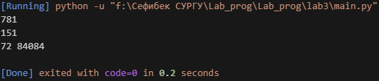

# Отчёт по лабораторной работе №3
Расчётные задачи. Itertools


# Задание для самостоятельного выполнения

## Сложность:                  *Rare*
1. Напишите программу для решения задач своего варианта.


2. Оформите отчёт в README.md. Отчёт должен содержать:
    - Условия задач
    - Описание проделанной работы
    - Скриншоты результатов
    - Ссылки на используемые материалы

## Требования и ограничения

Решения задач оформить в виде функций, возвращающих ответы. Для решения первой задачи использовать itertools.

## Вариант задания

12. - Игорь составляет таблицу кодовых слов для передачи сообщений, каждому сообщению соответствует своё кодовое слово. В качестве кодовых слов Игорь использует трёхбуквенные слова, в которых могут быть только буквы Ш, К, О, Л, А, причём буква К появляется ровно 1 раз. Каждая из других допустимых букв может встречаться в кодовом слове любое количество раз или не встречаться совсем. Сколько различных кодовых слов может использовать Игорь?
    - Значение арифметического выражения 3 · 4<sup>38</sup> + 2 · 4<sup>23</sup> + 4<sup>20</sup> + 3 · 4<sup>5</sup> + 2 · 4<sup>4</sup> + 1 записали в системе счисления с основанием 16. Сколько значащих нулей содержится в этой записи?
    - Напишите программу, которая перебирает целые числа, большие 600 000, в порядке возрастания и ищет среди них такие, среди делителей которых есть хотя бы одно число, оканчивающееся на 7, но не равное 7 и самому числу. Необходимо вывести первые 5 таких чисел, и наименьший делитель, оканчивающийся на 7, не равный 7 и самому числу.

        Формат вывода: для каждого из 5 таких найденных чисел в отдельной строке сначала выводится само число, затем  — наименьший делитель, оканчивающийся на 7, не равный 7 и самому числу. Строки выводятся в порядке возрастания найденных чисел.

## Ход работы:

### Описание проделанной работы

Общий подход

Все решения оформлены в виде отдельных функций. Для первой задачи использован модуль itertools. Программа написана на языке Python с использованием целочисленной арифметики, поддерживающей работу с большими числами.

### Решение задачи 1

Используем функцию itertools.product для генерации всех возможных 5-буквенных комбинаций из заданных букв. Затем подсчитываем только те комбинации, которые содержат букву 'И' хотя бы один раз.

```py
def task1() -> int:
    letters = ['И', 'В', 'А', 'Н']
    code_length = 5
    total_codes_with_i = 0
    
    for combination in itertools.product(letters, repeat=code_length):
        if 'И' in combination:
            total_codes_with_i += 1
    
    return total_codes_with_i
```

### Решение задачи 2

Вычисляем значение выражения с помощью целочисленной арифметики Python, затем переводим результат в восьмеричную систему с помощью встроенной функции oct() и считаем количество нулей.

```py
def task2() -> int:
    term1 = 7 * (512 ** 120)
    term2 = 6 * (64 ** 100)
    term3 = 8 ** 210
    result = term1 - term2 + term3 - 255
    
    octal_string = oct(result)[2:] # убираем префикс '0o'
    zero_count = octal_string.count('0')
    
    return zero_count
```

### Решение задачи 3

Для каждого числа в заданном диапазоне находим количество делителей оптимизированным способом (перебор до квадратного корня). Запоминаем число с максимальным количеством делителей (если несколько — берём минимальное).

```py
def find_divisors_count(n: int) -> int:
    count = 0
    for i in range(1, int(n ** 0.5) + 1):
        if n % i == 0:
            count += 1
            if i != n // i:
                count += 1
    return count


def task3() -> tuple:
    start_num = 84052
    end_num = 84130
    
    max_divisors = 0
    number_with_max = 0
    
    for num in range(start_num, end_num + 1):
        current_divisors = find_divisors_count(num)
        if current_divisors > max_divisors:
            max_divisors = current_divisors
            number_with_max = num
    
    return (max_divisors, number_with_max)
```

## Скриншоты результатов



## Ссылки на используемые материалы

1. https://evil-teacher.orbiter.website/prog_pm/lab03/

2. https://habr.com/ru/companies/otus/articles/529356/

3. https://docs.python.org/3/library/itertools.html

4. https://proglib.io/p/iteriruemsya-pravilno-20-priemov-ispolzovaniya-v-python-modulya-itertools-2020-01-03
