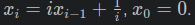
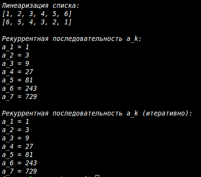

# Лабораторная работа №4

## Рекурсия

### Вариант 12

---

## Условия задач

### Задача 1: Линеаризация вложенных списков

Функция для вычисления всех перестановок списка длиной k.

```py
>>> k_permutaions([1, 2, 3], 2)
[[1, 2], [1, 3], [2, 1], [2, 3], [3, 1], [3, 2]]
```

Функция для вычисления 

## Ход работы

1. Написание функции с рекурсией

```py
def linearize_recursive(nested_list):
    """
    Рекурсивная линеаризация вложенного списка.
    """
    result = []
    for item in nested_list:
        if isinstance(item, list):
            result.extend(linearize_recursive(item))
        else:
            result.append(item)
    return result


def linearize_iterative(nested_list):
    """
    Итеративная линеаризация вложенного списка.
    """
    result = []
    stack = [nested_list]
    
    while stack:
        current = stack.pop()
        if isinstance(current, list):
            for item in reversed(current):
                stack.append(item)
        else:
            result.append(current)
    
    return list(reversed(result))
```

Алгоритм:

    1. Создаётся пустой список для результата

    2. Для каждого элемента входного списка:

      - Если элемент является списком, вызывается рекурсивно функция для него, а результат добавляется к итоговому списку

      - Если элемент не является списком, он просто добавляется в результат

    1. Возвращается полученный плоский список

Задача 2: Расчёт рекуррентной последовательности

Алгоритм:

    1. Базовый случай: при k = 1 возвращается (1, 1)

    2. Рекурсивно вычисляются значения для k-1

    3. По формулам вычисляются a_k и b_k

    4. Функция возвращает только a_k

1. Написание функции без рекурсии

```py
def a_recursive(k):
    """
    Рекурсивное вычисление a_k.
    a_1 = 1, a_k = 2*b_{k-1} + a_{k-1}, b_k = 2*a_{k-1} + b_{k-1}
    """
    def helper(k):
        if k == 1:
            return 1, 1
        a_prev, b_prev = helper(k - 1)
        a_k = 2 * b_prev + a_prev
        b_k = 2 * a_prev + b_prev
        return a_k, b_k
    
    return helper(k)[0]


def a_iterative(k):
    """
    Итеративное вычисление a_k.
    a_1 = 1, a_k = 2*b_{k-1} + a_{k-1}, b_k = 2*a_{k-1} + b_{k-1}
    """
    if k == 1:
        return 1
    
    a_prev, b_prev = 1, 1
    
    for _ in range(2, k + 1):
        a_k = 2 * b_prev + a_prev
        b_k = 2 * a_prev + b_prev
        a_prev, b_prev = a_k, b_k
    
    return a_prev
```

Алгоритм с использованием стека:

    1. Создаётся пустой список для результата

    2. Исходный список помещается в стек

    3. Пока стек не пуст:

      - Извлекается верхний элемент

      - Если это список, его элементы (в обратном порядке) помещаются обратно в стек

      - Если это не список, элемент добавляется в результат

    1. Возвращается результат (перевёрнутый для сохранения порядка)


Задача 2:

Алгоритм:

    1. При k = 1 сразу возвращается 1

    2. Инициализируются переменные a_prev = 1, b_prev = 1

    3. В цикле от 2 до k:

      - Вычисляются a_k и b_k по формулам

      - Значения сохраняются для следующей итерации

    1. Возвращается a_k

## Результат выполнения



## Источники:

  1. Recursion in Programming - Full Course - freeCodeCamp.org
  2. 🐍 Самоучитель по Python для начинающих. Часть 13: Рекурсивные функции - proglib.io
  3. Как работает рекурсия – объяснение в блок-схемах и видео - Хабр