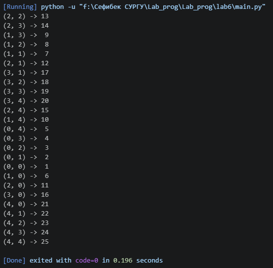

# Лабораторная работа №6 — Генераторы (Вариант 12)

## Сложность:                  *Rare*
1. Решите задачу своего варианта.

2. Оформите отчёт в README.md. Отчёт должен содержать:
    - Условия задач
    - Описание проделанной работы
    - Скриншоты результатов
    - Ссылки на используемые материалы

## Вариант задания 

12. - Генератор, который обходит элементы матрицы по спирали, начиная с центра в указанном направлении (не все матрицы можно так обойти).
    

## Описание проделанной работы
- Реализован генератор `spiral_from_center(matrix)` в файле `spiral_generator.py`.
- Алгоритм:
  1. Находим центр матрицы.
  2. Возвращаем центральный элемент.
  3. Последовательно увеличиваем длину шага: 1, 1, 2, 2, 3, 3, ...
  4. Движение: право → верх → лево → низ, и так далее.
  5. Как только выходим за пределы матрицы — генерация завершается.
- Написана демонстрационная программа `main.py`.

## Скриншоты результатов

