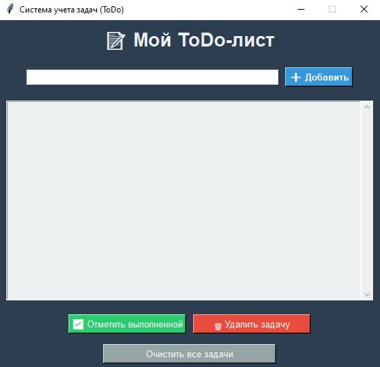

# Прог. Лабораторная работа №8
Итоговый проект

## Задания для самостоятельного выполнения

### Сложность:         *Rare*

1. Реализуйте приложение с GUI (приложения-игры допускается делать с использованием TUI-пакетов) по своему варианту. Можно изменить задание на собственную тему, согласовав с преподавателем. Список GUI фреймворков:

- appJar
- Tkinter
- Flet
- wxPython
- PySimpleGUI
- Pyforms
- Toga
- PyGObject
- guizero
- guietta
- PySide6
- Dear PyGui
- PyGame

2. Оформите README.md. Он должен содержать:

- Название вашего приложения
- Описание
- Инструкции по запуску
- Краткую справку

## Ход работы:

### 1. Реализация приложения

**GUI фреймворк: Tkinter (встроенный в Python)**

### 2. Оформление README.md

#### 2.1 Название приложения

**Тема: «Система учета задач (ToDo)»**

#### 2.2 Описание

Простое десктопное приложение для управления задачами (ToDo-лист).  
Позволяет добавлять задачи, отмечать их как выполненные и удалять.

#### 2.3 Инструкция по запуску

```bash
python main.py
```

##### 2.4 Краткая справка

- **Поле ввода** – введите текст и нажмите Enter для фиксации новой задачи

- Кнопка **"Добавить"** – добавляет задачу в список

- **Список задач** – отображает все задачи с индексами и статусом [ ] (не выполнено) / [✓] (выполнено)

- Кнопка **"Отметить выполненной"** – отмечает выбранную задачу как выполненную (меняет цвет на серый)

- Кнопка **"Удалить задачу"** – удаляет выделенную задачу

- Кнопка **"Очистить все задачи"** – удаляет все задачи после подтверждения

### Скриншоты выполненой задачи 

